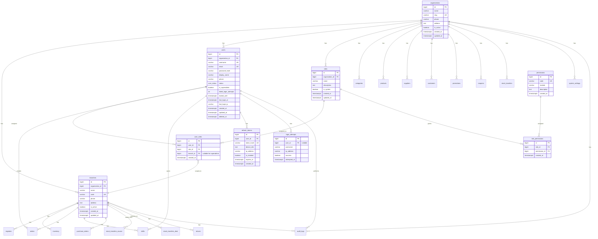
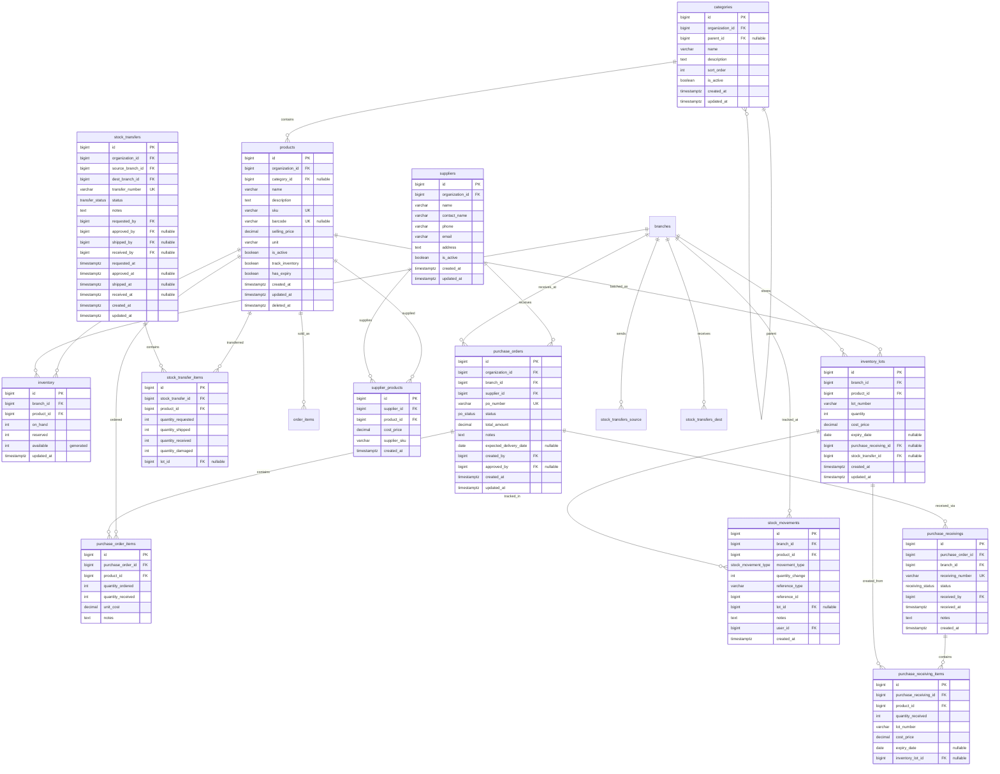
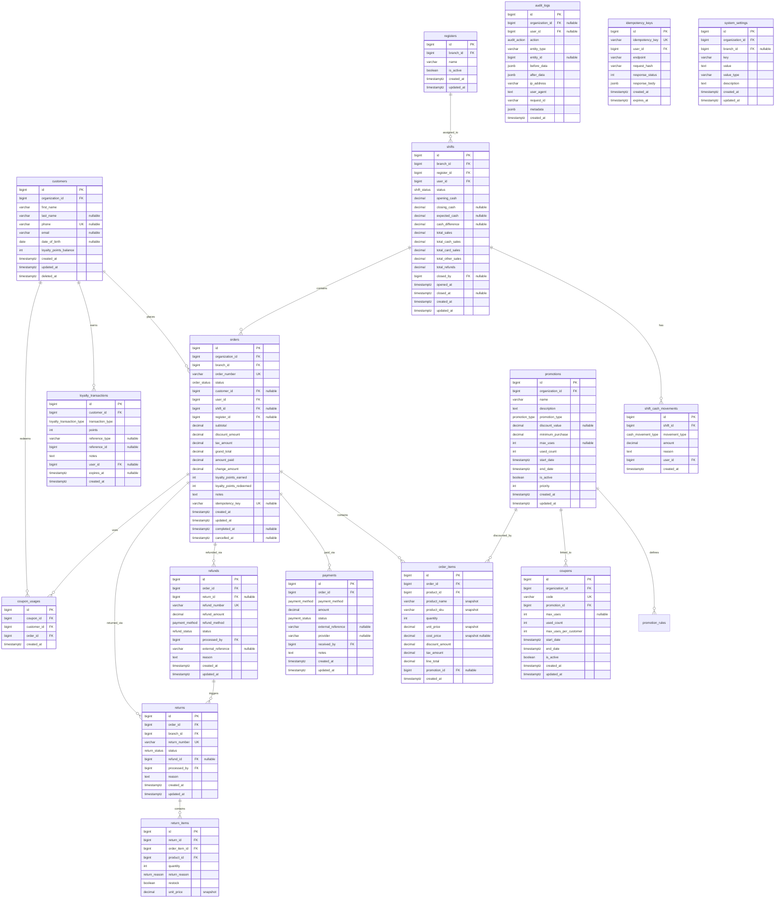

# Phase 1 — The Bottle Club POS Backend Architecture

## Phase 0 Context (Stated Assumptions Used Throughout)

| Parameter | Value |
|---|---|
| Country / Market | Thailand |
| Currency | THB |
| Tax Model | No tax/tax invoice requirement for now (assumption: pre-revenue or exempt; schema will support adding VAT later) |
| Legal Receipt | Gapless sequential receipt numbers required |
| Tenancy | Single-tenant, multi-branch (design entities so an `organizations` table could be inserted later without full rewrite) |
| Branches Today | 1-3 |
| Branches in 2-3 Years | 5-10 |
| Orders/Day Today | 50-200 |
| Orders/Day in 2-3 Years | 500-1,000 |
| Concurrent POS Writes at Peak | 10-20 (10 branches × 2 terminals × peak hour) |
| Data Retention | Financial records kept indefinitely (no legal retention limit stated) |
| Order Number Format | BRANCHCODE-YYYYMMDD-0001, resets daily per branch, gapless |
| Team Size | 1-2 developers |
| Deployment Target | Single VPS or small cloud |
| Tech Stack | Python/FastAPI + SQLAlchemy + PostgreSQL 16 (keep current) |

**Assumption on tax**: Thailand requires VAT 7% tax invoices for most businesses. I will flag where VAT support needs to be added to the schema even if v1 doesn't implement the tax calculation logic. The schema MUST NOT paint itself into a corner where adding VAT later requires a rewrite.

---

## 1. Executive Summary

The current codebase is a minimal FastAPI CRUD scaffold with 2 tables (users, products) and zero POS functionality. It is not a POS system — it is a starting point that needs to be replaced, not extended. Here is what is fundamentally wrong:

1. **No branch model**: Products have a single global stock number. A multi-branch POS requires per-branch inventory. This is a schema-level redesign, not an addition.
2. **No order/transaction system**: There is no concept of a sale, a payment, a receipt, or a customer. The entire transactional core is missing.
3. **No authentication or authorization**: Every endpoint is fully open. This is unacceptable for any POS system handling money.
4. **Single `stock` integer on products**: No support for lots/batches, expiration dates, cost tracking, per-branch quantities, or concurrent access safety. The `PATCH /products/{id}/stock` endpoint has a race condition — it reads `product.stock`, computes in Python, then writes back, which will cause oversells under concurrent access.
5. **No audit trail**: Destructive deletes on users and products with no history. Financial regulations require immutable audit logs.
6. **No financial data modeling**: No concept of payments, refunds, totals, discounts, or tax.
7. **No customer model**: No way to track who bought what, enable loyalty, or issue receipts to named customers.
8. **Integer PKs with autoincrement**: Acceptable for this scale (BIGINT), but the schema doesn't use them consistently and has no plan for branch-scoped uniqueness.
9. **No soft delete**: Hard deletes on users and products mean data is permanently lost. Products referenced by historical orders must never be deleted.
10. **Database driver mismatch**: `.env` uses `postgresql+psycopg://` (psycopg v3) but `requirements.txt` only installs `psycopg2-binary`. This will fail at runtime.

**Shape of the fix**: The existing codebase provides a working FastAPI + SQLAlchemy + Alembic foundation. We keep that infrastructure and build the POS domain model on top of it. The `users` and `products` tables will be completely replaced (not migrated) since they lack the fields and constraints the POS requires. The application structure will be reorganized into domain-oriented modules. The following phases define exactly what gets built.

---

## 2. Existing Architecture Audit

| Current Component | Problem | Severity | Why It Is A Problem | Recommended Solution |
|---|---|---|---|---|
| `products.stock` (single Integer) | No per-branch inventory | CRITICAL | Multi-branch POS cannot function with global stock | Replace with `inventory` table: branch_id + product_id → quantity on hand |
| `products.stock` (Integer, no locking) | Race condition on stock update | CRITICAL | Two terminals selling the last unit simultaneously will both succeed, causing negative stock | Use `SELECT ... FOR UPDATE` or `UPDATE ... WHERE stock >= quantity` with row-level locking in a transaction |
| No orders/payments/refunds | No transaction system | CRITICAL | Cannot record sales, which is the core function of a POS | Build complete Sales domain: orders, order_items, payments, refunds, returns |
| No authentication | All endpoints fully open | CRITICAL | Anyone can read/write/delete all data, including financial records | Implement JWT-based auth with role-based access control |
| No authorization/RBAC | No permission model | CRITICAL | No way to restrict what staff vs managers vs admins can do | Build roles, permissions, role_permissions, user_roles |
| No branch model | System cannot handle multiple locations | CRITICAL | The business has 1-3 branches and growing; no way to isolate inventory, sales, or staff by branch | Add branches table; scope all branch-relevant entities with branch_id |
| No customers | Cannot track buyers | HIGH | Loyalty programs, receipt printing, and sales analytics all require knowing who purchased | Add customers table linked to orders |
| Hard deletes on users/products | Permanent data loss | HIGH | If a product was sold, its record must persist for historical order accuracy | Soft delete (deleted_at timestamp) for reference entities; hard delete forbidden for transactional data |
| `products.price` (single price) | No cost tracking, no price history | HIGH | Cannot calculate margins, track cost of goods sold, or know what a product cost at time of purchase | Add `cost_price` to products; track actual cost in inventory_lots; snapshot price at order time |
| `PATCH /products/{id}/stock` (query param) | Stock adjustment via query string, no audit | HIGH | Stock changes have no source document, no user attribution, no before/after record | Replace with stock_adjustments endpoint backed by stock_movements audit trail |
| No idempotency | Duplicate requests cause duplicate data | HIGH | Network retries, POS double-taps, or client bugs can create duplicate orders/payments | Add idempotency_keys table; require idempotency key on all write endpoints |
| `users` table (no password, no roles) | Cannot authenticate | HIGH | Users table is a flat name+email record with no auth capability | Redesign users with password_hash, role assignment, status, branch access |
| No audit logs | No tamper-resistant history | HIGH | Cannot investigate fraud, errors, or data changes | Add append-only audit_logs table with user, action, before/after, IP, timestamp |
| No enums on status fields | Application must enforce valid states | MEDIUM | Database allows invalid status values | Use PostgreSQL ENUMs or CHECK constraints for all status fields |
| `products.description` (String) | Short text only, no rich content | MEDIUM | Products may need longer descriptions or notes | Use TEXT type instead of String for description fields |
| No timestamps on all tables | No created_at/updated_at on future tables | MEDIUM | Cannot track when records were created or modified | Add `created_at` and `updated_at` (where mutable) to every table |
| No pagination on users list | Returns all users | MEDIUM | As user count grows, response becomes slow and large | Add cursor or offset pagination to all list endpoints |
| No CORS configuration | Browser requests may be blocked | MEDIUM | Frontend on different origin cannot call the API | Configure CORS middleware in FastAPI |
| No error handling middleware | Unhandled errors return raw 500s | MEDIUM | Inconsistent error responses, potential info leakage | Add global exception handler with structured error responses |
| No request validation beyond Pydantic | No rate limiting, no input sanitization | MEDIUM | Vulnerable to abuse, no protection against brute force | Add rate limiting middleware, input sanitization |
| `psycopg2-binary` vs `postgresql+psycopg://` driver mismatch | Will fail at connection time | HIGH | The app cannot start if the correct driver isn't installed | Fix requirements.txt to use `psycopg[binary]` (psycopg v3) matching the connection string, or change the URL scheme to `postgresql+psycopg2://` |
| No Docker/docker-compose | Inconsistent dev environments | LOW | Developers may have different PostgreSQL versions/configs | Add docker-compose.yml for local development with PostgreSQL and Redis |
| No tests | No safety net for changes | HIGH | Refactoring the schema and building 30+ tables without tests is dangerous | Build test suite alongside implementation (Phase 5) |
| No type hints on return values | Inconsistent response shapes | LOW | Client cannot reliably predict response structure | Already partially addressed with Pydantic response_model, extend to all endpoints |

---

## 3. Domain Architecture

The system is divided into 11 bounded domains. Each domain owns its entities and business rules but may depend on entities from other domains.

### 3.1 Identity & Access Management (IAM)
- **Responsibility**: User accounts, authentication, authorization, sessions, password management
- **Main entities**: users, roles, permissions, role_permissions, user_roles, refresh_tokens, login_attempts
- **Dependencies**: Organization (for future multi-tenant), Branch (for branch-scoped access)
- **Business rules**:
  - One user can belong to multiple branches (many-to-many via user_roles scoped to branch)
  - Passwords stored with bcrypt, never plaintext
  - Refresh tokens are rotatable, single-use per device
  - Account locks after 5 failed login attempts for 15 minutes
  - Superadmin role is branch-independent; other roles are branch-scoped

### 3.2 Organization & Branch
- **Responsibility**: Business entity, physical locations, register assignment
- **Main entities**: organizations (future), branches, registers
- **Dependencies**: IAM (branch admins)
- **Business rules**:
  - Each branch has a unique 2-4 character code (e.g., "BK1", "CM2")
  - Each branch has its own set of registers, order numbering sequence, and inventory
  - Branch codes are immutable after creation (used in order numbers)
  - In single-tenant mode, there is one organization record; the schema supports adding more later

### 3.3 Catalog
- **Responsibility**: Product definitions, categories, suppliers, pricing
- **Main entities**: categories, products, suppliers, supplier_products
- **Dependencies**: None (leaf domain)
- **Business rules**:
  - Products have a selling_price (what customer pays) and reference cost comes from inventory_lots
  - Products belong to one category; categories support nesting (parent_id)
  - SKUs are globally unique; barcodes are globally unique (if present)
  - Products are never hard-deleted once they have any stock_movements or order_items

### 3.4 Inventory
- **Responsibility**: Per-branch stock quantities, lot/batch tracking, expiration, stock movements
- **Main entities**: inventory (per-branch quantity), inventory_lots (batch tracking), stock_movements (audit trail)
- **Dependencies**: Catalog (products), Branch, Organization
- **Business rules**:
  - `inventory` = one row per (branch_id, product_id) with current on_hand, reserved, and available quantities
  - `inventory_lots` = one row per received batch with cost, expiry, lot_number; supports FEFO
  - `stock_movements` = append-only ledger of every quantity change, referencing its source document
  - Stock can never go negative (enforced by DB constraint + application logic)
  - `available = on_hand - reserved` must always be >= 0
  - Lot selection at sale time uses FEFO (first-expiry-first-out)

### 3.5 Purchasing
- **Responsibility**: Supplier management, purchase orders, receiving goods into inventory
- **Main entities**: suppliers, purchase_orders, purchase_order_items, purchase_receivings, purchase_receiving_items
- **Dependencies**: Catalog (products), Inventory (inventory_lots, stock_movements), Branch
- **Business rules**:
  - PO goes through: DRAFT → CONFIRMED → PARTIALLY_RECEIVED → RECEIVED → CANCELLED
  - Receiving is separate from PO (supports partial receiving over multiple deliveries)
  - Each receiving creates inventory_lots and stock_movements
  - Cost price at receiving time becomes the lot cost; used for FEFO and COGS calculation
  - Over-receiving is configurable (allow/reject based on PO tolerance setting)

### 3.6 Stock Transfers
- **Responsibility**: Moving inventory between branches with full audit trail
- **Main entities**: stock_transfers, stock_transfer_items
- **Dependencies**: Branch, Inventory, Catalog
- **Business rules**:
  - Transfer goes through: REQUESTED → APPROVED → IN_TRANSIT → RECEIVED / CANCELLED
  - Source branch inventory is reduced at shipment; destination branch inventory increased at receiving
  - Damaged goods during transfer are tracked separately (damaged_quantity)
  - Partial receiving supported
  - Approval required from destination branch manager

### 3.7 Sales (Orders)
- **Responsibility**: POS order lifecycle, order items, order numbering
- **Main entities**: orders, order_items
- **Dependencies**: Catalog (products), Inventory (stock deduction), Payments, Customers, Promotions, Shifts, Branch
- **Business rules**:
  - Order lifecycle: DRAFT → PENDING → PAID → COMPLETED → (CANCELLED / REFUNDED)
  - Order number generated: BRANCHCODE-YYYYMMDD-NNNN (gapless, daily reset per branch)
  - Inventory is RESERVED at DRAFT, DEDUCTED at PAID
  - All monetary values on order_items are SNAPSHOTS (price, tax, discount at time of sale)
  - Order total = Σ(item.price × qty) − promotions + tax (if applicable)
  - One order can have multiple payment rows (cash + QR, etc.) — no MIXED payment type

### 3.8 Payments & Refunds
- **Responsibility**: Payment processing, refund processing, financial reconciliation
- **Main entities**: payments, refunds, refund_items
- **Dependencies**: Sales (orders), Customers
- **Business rules**:
  - Each order can have multiple payment rows (supports split payments)
  - Payment statuses: PENDING → COMPLETED / FAILED / REFUNDED
  - Refund is always linked to an order and specific order_items (partial or full)
  - Refund creates a refund record and payment transaction (reverse entry)
  - Refund amount cannot exceed original payment amount
  - Each payment/refund has an external reference (transaction ID from payment provider)

### 3.9 Returns
- **Responsibility**: Processing product returns (separate from refund), restocking decisions
- **Main entities**: returns, return_items
- **Dependencies**: Sales (orders), Inventory (stock adjustment on restock), Payments (triggers refund)
- **Business rules**:
  - Return reasons: DEFECTIVE, DAMAGED, EXPIRED, WRONG_ITEM, CUSTOMER_CHANGE_MIND
  - Return items can be restockable (returned to shelf) or non-restockable (damaged/write-off)
  - Return triggers a stock_movement (inbound) only for restockable items
  - Return triggers a refund request (may be pending manual approval)
  - Return window configurable per product/branch

### 3.10 Promotions & Coupons
- **Responsibility**: Discount rules, promotional pricing, coupon management
- **Main entities**: promotions, promotion_rules, coupons, coupon_usages
- **Dependencies**: Catalog (products, categories), Branch, Customers (for customer-specific promos)
- **Business rules**:
  - V1 (build now): Percentage discount, fixed discount, minimum purchase threshold, date range
  - V1 (schema allows later): Buy X get Y, free item, category-specific, branch-specific, usage limits
  - Coupons are single-use or multi-use with usage limits
  - Coupon usage tracked per customer
  - Promotions applied at order creation time; snapshot discount on order_items

### 3.11 Shifts & Cash Management
- **Responsibility**: Cash drawer tracking, shift open/close, cash in/out, reconciliation
- **Main entities**: shifts, shift_cash_movements
- **Dependencies**: Branch (register), Sales (orders during shift), Users (cashier)
- **Business rules**:
  - One shift per register per time period; opened by cashier, closed by cashier or manager
  - Opening cash float recorded at shift start
  - Cash in (e.g., petty cash added) and cash out (e.g., withdrawal) tracked with reason
  - Shift closing calculates: expected cash = opening + cash sales − cash refunds + cash_in − cash_out
  - Cash discrepancy = expected − actual counted
  - All shift cash movements have user_id, reason, and timestamp

### 3.12 Audit & System
- **Responsibility**: Immutable audit trail, system configuration, reporting data
- **Main entities**: audit_logs, system_settings, idempotency_keys
- **Dependencies**: Cross-cutting (records events from all other domains)
- **Business rules**:
  - Audit logs are append-only, never updated or deleted
  - Every financial mutation, stock change, user login, and configuration change creates an audit log
  - System settings are key-value with type metadata and branch override capability
  - Idempotency keys prevent duplicate writes for critical operations

---

## 4. Complete Entity List

Below is every entity in the system. Field types use Python/SQLAlchemy notation. `DECIMAL(12,2)` = `Numeric(12,2)`.

### 4.1 organizations
**Purpose**: Top-level business entity. Placeholder for future multi-tenant support; currently one record.
| Field | Type | Nullable | Default | Unique | Notes |
|---|---|---|---|---|---|
| id | BIGINT | no | autoincrement | PK | |
| name | VARCHAR(255) | no | | no | Business name |
| slug | VARCHAR(100) | no | | yes | URL-safe identifier |
| phone | VARCHAR(20) | yes | | no | |
| address | TEXT | yes | | no | |
| is_active | BOOLEAN | no | true | no | |
| created_at | TIMESTAMPTZ | no | now() | no | |
| updated_at | TIMESTAMPTZ | no | now() | no | |

**Foreign Keys**: None (top-level)
**Indexes**: slug (unique)
**Soft Delete**: No (use is_active)
**Audit**: Yes (organization configuration changes)

### 4.2 branches
**Purpose**: Physical store location. Each branch has its own inventory, registers, order sequence, and staff.
| Field | Type | Nullable | Default | Unique | Notes |
|---|---|---|---|---|---|
| id | BIGINT | no | autoincrement | PK | |
| organization_id | BIGINT | no | | FK → organizations.id | |
| name | VARCHAR(100) | no | | no | Branch display name |
| code | VARCHAR(4) | no | | yes | Immutable after creation, used in order numbers |
| phone | VARCHAR(20) | yes | | no | |
| address | TEXT | yes | | no | |
| is_active | BOOLEAN | no | true | no | |
| created_at | TIMESTAMPTZ | no | now() | no | |
| updated_at | TIMESTAMPTZ | no | now() | no | |

**Foreign Keys**: organization_id → organizations.id
**Indexes**: organization_id, code (unique)
**Soft Delete**: No (use is_active)
**Audit**: Yes

### 4.3 users
**Purpose**: System users (employees, managers, admins). Can belong to multiple branches.
| Field | Type | Nullable | Default | Unique | Notes |
|---|---|---|---|---|---|
| id | BIGINT | no | autoincrement | PK | |
| organization_id | BIGINT | no | | FK → organizations.id | |
| username | VARCHAR(50) | no | | yes | Login identifier |
| email | VARCHAR(255) | no | | yes | |
| password_hash | VARCHAR(255) | no | | no | bcrypt hash, never exposed |
| display_name | VARCHAR(100) | no | | no | |
| phone | VARCHAR(20) | yes | | no | |
| status | user_status | no | ACTIVE | no | ENUM: ACTIVE, INACTIVE, LOCKED |
| is_superadmin | BOOLEAN | no | false | no | Branch-independent admin |
| failed_login_attempts | INTEGER | no | 0 | no | For lockout logic |
| locked_until | TIMESTAMPTZ | yes | null | no | null = not locked |
| last_login_at | TIMESTAMPTZ | yes | null | no | |
| last_login_ip | VARCHAR(45) | yes | null | no | IPv6 compatible |
| created_at | TIMESTAMPTZ | no | now() | no | |
| updated_at | TIMESTAMPTZ | no | now() | no | |
| deleted_at | TIMESTAMPTZ | yes | null | no | Soft delete |

**Foreign Keys**: organization_id → organizations.id
**Indexes**: organization_id, username (unique), email (unique), status
**Soft Delete**: Yes (users may be referenced in audit_logs, orders)
**Audit**: Yes (user creation, modification, login, lockout)

### 4.4 roles
**Purpose**: Named permission groups (e.g., "Cashier", "Branch Manager", "Admin").
| Field | Type | Nullable | Default | Unique | Notes |
|---|---|---|---|---|---|
| id | BIGINT | no | autoincrement | PK | |
| organization_id | BIGINT | no | | FK → organizations.id | |
| name | VARCHAR(50) | no | | no | |
| description | TEXT | yes | | no | |
| is_system | BOOLEAN | no | false | no | System roles cannot be deleted |
| created_at | TIMESTAMPTZ | no | now() | no | |
| updated_at | TIMESTAMPTZ | no | now() | no | |

**Foreign Keys**: organization_id → organizations.id
**Indexes**: organization_id, UNIQUE(organization_id, name)
**Soft Delete**: No (roles deleted → user_roles cascade would lose history; use is_active pattern or prevent deletion of assigned roles)
**Audit**: Yes

### 4.5 permissions
**Purpose**: Granular permission definitions (e.g., "ORDER.CREATE", "INVENTORY.ADJUST").
| Field | Type | Nullable | Default | Unique | Notes |
|---|---|---|---|---|---|
| id | BIGINT | no | autoincrement | PK | |
| code | VARCHAR(50) | no | | yes | e.g., "ORDER.CREATE" |
| module | VARCHAR(30) | no | | no | e.g., "ORDER", "INVENTORY" |
| description | TEXT | yes | | no | |
| created_at | TIMESTAMPTZ | no | now() | no | |

**Foreign Keys**: None (seed data, not user-editable)
**Indexes**: code (unique), module
**Soft Delete**: No (permissions are fixed; removing one should revoke via role_permissions)
**Audit**: No (seed data)

### 4.6 role_permissions
**Purpose**: Many-to-many: which roles have which permissions.
| Field | Type | Nullable | Default | Unique | Notes |
|---|---|---|---|---|---|
| id | BIGINT | no | autoincrement | PK | |
| role_id | BIGINT | no | | FK → roles.id | |
| permission_id | BIGINT | no | | FK → permissions.id | |
| created_at | TIMESTAMPTZ | no | now() | no | |

**Foreign Keys**: role_id → roles.id, permission_id → permissions.id
**Indexes**: UNIQUE(role_id, permission_id), permission_id
**Soft Delete**: No
**Audit**: Yes (role permission changes are security-relevant)

### 4.7 user_roles
**Purpose**: Many-to-many: which users have which roles, scoped to a branch.
| Field | Type | Nullable | Default | Unique | Notes |
|---|---|---|---|---|---|
| id | BIGINT | no | autoincrement | PK | |
| user_id | BIGINT | no | | FK → users.id | |
| role_id | BIGINT | no | | FK → roles.id | |
| branch_id | BIGINT | yes | | FK → branches.id | null = org-wide role (superadmin) |
| created_at | TIMESTAMPTZ | no | now() | no | |

**Foreign Keys**: user_id → users.id, role_id → roles.id, branch_id → branches.id
**Indexes**: UNIQUE(user_id, role_id, branch_id), branch_id, role_id
**Soft Delete**: No
**Audit**: Yes (assignment changes)

### 4.8 categories
**Purpose**: Product categorization with optional parent for nesting.
| Field | Type | Nullable | Default | Unique | Notes |
|---|---|---|---|---|---|
| id | BIGINT | no | autoincrement | PK | |
| organization_id | BIGINT | no | | FK → organizations.id | |
| parent_id | BIGINT | yes | null | FK → categories.id | null = top-level |
| name | VARCHAR(100) | no | | no | |
| description | TEXT | yes | | no | |
| sort_order | INTEGER | no | 0 | no | Display ordering |
| is_active | BOOLEAN | no | true | no | |
| created_at | TIMESTAMPTZ | no | now() | no | |
| updated_at | TIMESTAMPTZ | no | now() | no | |

**Foreign Keys**: organization_id → organizations.id, parent_id → categories.id (self-referential)
**Indexes**: organization_id, parent_id, UNIQUE(organization_id, name)
**Soft Delete**: No (use is_active)
**Audit**: No

### 4.9 products
**Purpose**: Product definition. Price is the selling price; cost comes from inventory_lots.
| Field | Type | Nullable | Default | Unique | Notes |
|---|---|---|---|---|---|
| id | BIGINT | no | autoincrement | PK | |
| organization_id | BIGINT | no | | FK → organizations.id | |
| category_id | BIGINT | yes | null | FK → categories.id | |
| name | VARCHAR(255) | no | | no | |
| description | TEXT | yes | | no | |
| sku | VARCHAR(50) | no | | yes | Globally unique per org |
| barcode | VARCHAR(50) | yes | null | yes | Globally unique per org (if present) |
| selling_price | DECIMAL(12,2) | no | | no | Current selling price |
| unit | VARCHAR(20) | no | 'pcs' | no | pcs, bottle, kg, etc. |
| is_active | BOOLEAN | no | true | no | |
| track_inventory | BOOLEAN | no | true | no | false for service items |
| has_expiry | BOOLEAN | no | false | no | Whether lots track expiry |
| created_at | TIMESTAMPTZ | no | now() | no | |
| updated_at | TIMESTAMPTZ | no | now() | no | |
| deleted_at | TIMESTAMPTZ | yes | null | no | Soft delete |

**Foreign Keys**: organization_id → organizations.id, category_id → categories.id
**Indexes**: organization_id, category_id, sku (unique per org: UNIQUE(organization_id, sku)), barcode (unique per org: UNIQUE(organization_id, barcode)), name (for search)
**Soft Delete**: Yes (products referenced by orders/stock_movements must persist)
**Audit**: No

### 4.10 suppliers
**Purpose**: Supplier/vendor records.
| Field | Type | Nullable | Default | Unique | Notes |
|---|---|---|---|---|---|
| id | BIGINT | no | autoincrement | PK | |
| organization_id | BIGINT | no | | FK → organizations.id | |
| name | VARCHAR(255) | no | | no | |
| contact_name | VARCHAR(100) | yes | | no | |
| phone | VARCHAR(20) | yes | | no | |
| email | VARCHAR(255) | yes | | no | |
| address | TEXT | yes | | no | |
| is_active | BOOLEAN | no | true | no | |
| created_at | TIMESTAMPTZ | no | now() | no | |
| updated_at | TIMESTAMPTZ | no | now() | no | |

**Foreign Keys**: organization_id → organizations.id
**Indexes**: organization_id, name
**Soft Delete**: No (use is_active; suppliers referenced by purchase_orders)
**Audit**: No

### 4.11 inventory
**Purpose**: Current stock quantity per branch per product. This is the "balance" table; the ledger is stock_movements.
| Field | Type | Nullable | Default | Unique | Notes |
|---|---|---|---|---|---|
| id | BIGINT | no | autoincrement | PK | |
| branch_id | BIGINT | no | | FK → branches.id | |
| product_id | BIGINT | no | | FK → products.id | |
| on_hand | INTEGER | no | 0 | no | Physical quantity available |
| reserved | INTEGER | no | 0 | no | Reserved for pending orders |
| available | INTEGER | no | 0 | no | Computed: on_hand - reserved (DB-generated column) |
| updated_at | TIMESTAMPTZ | no | now() | no | |

**Foreign Keys**: branch_id → branches.id, product_id → products.id
**Indexes**: UNIQUE(branch_id, product_id), branch_id, product_id
**Soft Delete**: No (balance table, never deleted)
**Audit**: No (audit is in stock_movements)

**CHECK constraints**: `on_hand >= 0`, `reserved >= 0`, `available = on_hand - reserved` (or computed column)

### 4.12 inventory_lots
**Purpose**: Tracks individual batches/lots of inventory received, with cost and expiry.
| Field | Type | Nullable | Default | Unique | Notes |
|---|---|---|---|---|---|
| id | BIGINT | no | autoincrement | PK | |
| branch_id | BIGINT | no | | FK → branches.id | |
| product_id | BIGINT | no | | FK → products.id | |
| lot_number | VARCHAR(50) | no | | no | Supplier lot/batch number |
| quantity | INTEGER | no | 0 | no | Remaining quantity in this lot |
| cost_price | DECIMAL(12,2) | no | | no | Cost per unit at receiving |
| expiry_date | DATE | yes | null | no | null if product has no expiry |
| purchase_receiving_id | BIGINT | yes | null | FK → purchase_receivings.id | Source document |
| stock_transfer_id | BIGINT | yes | null | FK → stock_transfers.id | If received via transfer |
| created_at | TIMESTAMPTZ | no | now() | no | |
| updated_at | TIMESTAMPTZ | no | now() | no | |

**Foreign Keys**: branch_id → branches.id, product_id → products.id, purchase_receiving_id → purchase_receivings.id, stock_transfer_id → stock_transfers.id
**Indexes**: UNIQUE(branch_id, product_id, lot_number), branch_id + product_id + expiry_date (for FEFO query), product_id
**Soft Delete**: No
**Audit**: No (stock_movements tracks all changes)

**CHECK constraints**: `quantity >= 0`

### 4.13 stock_movements
**Purpose**: Immutable ledger of every inventory quantity change. The single source of truth for "why does this product have X units?"
| Field | Type | Nullable | Default | Unique | Notes |
|---|---|---|---|---|---|
| id | BIGINT | no | autoincrement | PK | |
| branch_id | BIGINT | no | | FK → branches.id | |
| product_id | BIGINT | no | | FK → products.id | |
| movement_type | stock_movement_type | no | | no | ENUM (see below) |
| quantity_change | INTEGER | no | | no | Positive = inbound, negative = outbound |
| reference_type | VARCHAR(30) | no | | no | Polymorphic: 'order', 'purchase_receiving', 'transfer', 'adjustment', 'return' |
| reference_id | BIGINT | no | | no | FK to the source document |
| lot_id | BIGINT | yes | null | FK → inventory_lots.id | Which lot was affected |
| notes | TEXT | yes | | no | Human-readable reason |
| user_id | BIGINT | no | | FK → users.id | Who made this change |
| created_at | TIMESTAMPTZ | no | now() | no | Immutable timestamp |

**Foreign Keys**: branch_id → branches.id, product_id → products.id, lot_id → inventory_lots.id, user_id → users.id
**Indexes**: branch_id + product_id (balance queries), reference_type + reference_id (source lookup), created_at (reporting), movement_type, user_id
**Soft Delete**: No (NEVER deleted)
**Audit**: Yes (this IS the audit trail for inventory)

**Stock movement types (ENUM)**: PURCHASE, SALE, RETURN_INBOUND, TRANSFER_OUT, TRANSFER_IN, ADJUSTMENT_IN, ADJUSTMENT_OUT, DAMAGED, EXPIRED, OPENING_STOCK

### 4.14 purchase_orders
**Purpose**: Formal order to a supplier for goods.
| Field | Type | Nullable | Default | Unique | Notes |
|---|---|---|---|---|---|
| id | BIGINT | no | autoincrement | PK | |
| organization_id | BIGINT | no | | FK → organizations.id | |
| branch_id | BIGINT | no | | FK → branches.id | Receiving branch |
| supplier_id | BIGINT | no | | FK → suppliers.id | |
| po_number | VARCHAR(30) | no | | yes | PO-YYYYMMDD-NNNN (per org) |
| status | po_status | no | DRAFT | no | ENUM |
| total_amount | DECIMAL(12,2) | no | 0 | no | Sum of items |
| notes | TEXT | yes | | no | |
| expected_delivery_date | DATE | yes | null | no | |
| created_by | BIGINT | no | | FK → users.id | |
| approved_by | BIGINT | yes | null | FK → users.id | |
| created_at | TIMESTAMPTZ | no | now() | no | |
| updated_at | TIMESTAMPTZ | no | now() | no | |

**Foreign Keys**: organization_id → organizations.id, branch_id → branches.id, supplier_id → suppliers.id, created_by → users.id, approved_by → users.id
**Indexes**: organization_id, branch_id, supplier_id, po_number (unique), status, created_at
**Soft Delete**: No (purchase records are financial)
**Audit**: Yes

### 4.15 purchase_order_items
**Purpose**: Line items on a purchase order.
| Field | Type | Nullable | Default | Unique | Notes |
|---|---|---|---|---|---|
| id | BIGINT | no | autoincrement | PK | |
| purchase_order_id | BIGINT | no | | FK → purchase_orders.id | |
| product_id | BIGINT | no | | FK → products.id | |
| quantity_ordered | INTEGER | no | | no | Ordered quantity |
| quantity_received | INTEGER | no | 0 | no | Received so far |
| unit_cost | DECIMAL(12,2) | no | | no | Agreed cost per unit |
| notes | TEXT | yes | | no | |

**Foreign Keys**: purchase_order_id → purchase_orders.id, product_id → products.id
**Indexes**: purchase_order_id, product_id
**Soft Delete**: No
**Audit**: No

**CHECK constraints**: `quantity_received <= quantity_ordered + tolerance`, `unit_cost >= 0`

### 4.16 purchase_receivings
**Purpose**: Document recording actual goods received against a PO (supports partial receiving).
| Field | Type | Nullable | Default | Unique | Notes |
|---|---|---|---|---|---|
| id | BIGINT | no | autoincrement | PK | |
| purchase_order_id | BIGINT | no | | FK → purchase_orders.id | |
| branch_id | BIGINT | no | | FK → branches.id | Receiving branch |
| receiving_number | VARCHAR(30) | no | | yes | REC-YYYYMMDD-NNNN |
| status | receiving_status | no | PENDING | no | ENUM: PENDING, COMPLETED, CANCELLED |
| received_by | BIGINT | no | | FK → users.id | |
| received_at | TIMESTAMPTZ | no | now() | no | |
| notes | TEXT | yes | | no | |
| created_at | TIMESTAMPTZ | no | now() | no | |

**Foreign Keys**: purchase_order_id → purchase_orders.id, branch_id → branches.id, received_by → users.id
**Indexes**: purchase_order_id, branch_id, receiving_number (unique), status
**Soft Delete**: No
**Audit**: Yes

### 4.17 purchase_receiving_items
**Purpose**: Line items on a receiving document — which products, how many, which lot, expiry.
| Field | Type | Nullable | Default | Unique | Notes |
|---|---|---|---|---|---|
| id | BIGINT | no | autoincrement | PK | |
| purchase_receiving_id | BIGINT | no | | FK → purchase_receivings.id | |
| product_id | BIGINT | no | | FK → products.id | |
| quantity_received | INTEGER | no | | no | |
| lot_number | VARCHAR(50) | no | | no | |
| cost_price | DECIMAL(12,2) | no | | no | Cost at time of receiving |
| expiry_date | DATE | yes | null | no | |
| inventory_lot_id | BIGINT | yes | null | FK → inventory_lots.id | Created/updated lot |

**Foreign Keys**: purchase_receiving_id → purchase_receivings.id, product_id → products.id, inventory_lot_id → inventory_lots.id
**Indexes**: purchase_receiving_id, product_id
**Soft Delete**: No
**Audit**: No

### 4.18 stock_transfers
**Purpose**: Document for moving inventory between branches.
| Field | Type | Nullable | Default | Unique | Notes |
|---|---|---|---|---|---|
| id | BIGINT | no | autoincrement | PK | |
| organization_id | BIGINT | no | | FK → organizations.id | |
| source_branch_id | BIGINT | no | | FK → branches.id | Sending branch |
| dest_branch_id | BIGINT | no | | FK → branches.id | Receiving branch |
| transfer_number | VARCHAR(30) | no | | yes | TRF-YYYYMMDD-NNNN |
| status | transfer_status | no | REQUESTED | no | ENUM |
| notes | TEXT | yes | | no | |
| requested_by | BIGINT | no | | FK → users.id | |
| approved_by | BIGINT | yes | null | FK → users.id | |
| shipped_by | BIGINT | yes | null | FK → users.id | |
| received_by | BIGINT | yes | null | FK → users.id | |
| requested_at | TIMESTAMPTZ | no | now() | no | |
| approved_at | TIMESTAMPTZ | yes | null | no | |
| shipped_at | TIMESTAMPTZ | yes | null | no | |
| received_at | TIMESTAMPTZ | yes | null | no | |
| created_at | TIMESTAMPTZ | no | now() | no | |
| updated_at | TIMESTAMPTZ | no | now() | no | |

**Foreign Keys**: organization_id → organizations.id, source_branch_id → branches.id, dest_branch_id → branches.id, requested_by → users.id, approved_by → users.id, shipped_by → users.id, received_by → users.id
**Indexes**: organization_id, source_branch_id, dest_branch_id, transfer_number (unique), status, created_at
**Soft Delete**: No
**Audit**: Yes

### 4.19 stock_transfer_items
**Purpose**: Line items on a stock transfer.
| Field | Type | Nullable | Default | Unique | Notes |
|---|---|---|---|---|---|
| id | BIGINT | no | autoincrement | PK | |
| stock_transfer_id | BIGINT | no | | FK → stock_transfers.id | |
| product_id | BIGINT | no | | FK → products.id | |
| quantity_requested | INTEGER | no | | no | |
| quantity_shipped | INTEGER | no | 0 | no | |
| quantity_received | INTEGER | no | 0 | no | |
| quantity_damaged | INTEGER | no | 0 | no | |
| lot_id | BIGINT | yes | null | FK → inventory_lots.id | Specific lot being transferred |

**Foreign Keys**: stock_transfer_id → stock_transfers.id, product_id → products.id, lot_id → inventory_lots.id
**Indexes**: stock_transfer_id, product_id
**Soft Delete**: No
**Audit**: No

**CHECK constraints**: `quantity_shipped >= 0`, `quantity_received >= 0`, `quantity_damaged >= 0`

### 4.20 customers
**Purpose**: Customer records for loyalty and sales tracking.
| Field | Type | Nullable | Default | Unique | Notes |
|---|---|---|---|---|---|
| id | BIGINT | no | autoincrement | PK | |
| organization_id | BIGINT | no | | FK → organizations.id | |
| first_name | VARCHAR(100) | no | | no | |
| last_name | VARCHAR(100) | yes | null | no | |
| phone | VARCHAR(20) | yes | null | no | Unique per org |
| email | VARCHAR(255) | yes | null | no | |
| date_of_birth | DATE | yes | null | no | |
| loyalty_points_balance | INTEGER | no | 0 | no | Denormalized balance (source of truth = loyalty_transactions) |
| created_at | TIMESTAMPTZ | no | now() | no | |
| updated_at | TIMESTAMPTZ | no | now() | no | |
| deleted_at | TIMESTAMPTZ | yes | null | no | Soft delete |

**Foreign Keys**: organization_id → organizations.id
**Indexes**: organization_id, UNIQUE(organization_id, phone), phone, email
**Soft Delete**: Yes (customers may be referenced in orders)
**Audit**: No

### 4.21 loyalty_transactions
**Purpose**: Immutable ledger of all loyalty point changes. The ONLY source of truth for a customer's point balance.
| Field | Type | Nullable | Default | Unique | Notes |
|---|---|---|---|---|---|
| id | BIGINT | no | autoincrement | PK | |
| customer_id | BIGINT | no | | FK → customers.id | |
| transaction_type | loyalty_transaction_type | no | | no | ENUM: EARN, REDEEM, EXPIRE, ADJUSTMENT, REVERSAL |
| points | INTEGER | no | | no | Positive = earn, negative = redeem/expire |
| reference_type | VARCHAR(30) | yes | null | no | 'order', 'return', 'manual' |
| reference_id | BIGINT | yes | null | no | Source document ID |
| notes | TEXT | yes | | no | Reason for manual adjustment |
| user_id | BIGINT | yes | null | FK → users.id | Who performed manual adjustment |
| expires_at | TIMESTAMPTZ | yes | null | no | When these points expire |
| created_at | TIMESTAMPTZ | no | now() | no | |

**Foreign Keys**: customer_id → customers.id, user_id → users.id
**Indexes**: customer_id + created_at (balance calculation), customer_id + expires_at (expiry queries), transaction_type
**Soft Delete**: No (NEVER deleted — this is a financial ledger)
**Audit**: Yes

### 4.22 orders
**Purpose**: POS sale transaction. The central entity of the system.
| Field | Type | Nullable | Default | Unique | Notes |
|---|---|---|---|---|---|
| id | BIGINT | no | autoincrement | PK | |
| organization_id | BIGINT | no | | FK → organizations.id | |
| branch_id | BIGINT | no | | FK → branches.id | |
| order_number | VARCHAR(30) | no | | yes | BRANCHCODE-YYYYMMDD-NNNN |
| status | order_status | no | DRAFT | no | ENUM |
| customer_id | BIGINT | yes | null | FK → customers.id | Walk-in = null |
| user_id | BIGINT | no | | FK → users.id | Cashier who created the order |
| shift_id | BIGINT | yes | null | FK → shifts.id | |
| register_id | BIGINT | yes | null | FK → registers.id | |
| subtotal | DECIMAL(12,2) | no | 0 | no | Sum of item totals before discount/tax |
| discount_amount | DECIMAL(12,2) | no | 0 | no | Total promotional/coupon discount |
| tax_amount | DECIMAL(12,2) | no | 0 | no | Tax amount (for future VAT support) |
| grand_total | DECIMAL(12,2) | no | 0 | no | subtotal - discount_amount + tax_amount |
| amount_paid | DECIMAL(12,2) | no | 0 | no | Sum of completed payments |
| change_amount | DECIMAL(12,2) | no | 0 | no | Cash change given |
| loyalty_points_earned | INTEGER | no | 0 | no | Points earned on this order |
| loyalty_points_redeemed | INTEGER | no | 0 | no | Points used for payment |
| notes | TEXT | yes | | no | |
| idempotency_key | VARCHAR(64) | yes | null | yes | Prevent duplicate orders |
| created_at | TIMESTAMPTZ | no | now() | no | |
| updated_at | TIMESTAMPTZ | no | now() | no | |
| completed_at | TIMESTAMPTZ | yes | null | no | |
| cancelled_at | TIMESTAMPTZ | yes | null | no | |

**Foreign Keys**: organization_id → organizations.id, branch_id → branches.id, customer_id → customers.id, user_id → users.id, shift_id → shifts.id, register_id → registers.id
**Indexes**: branch_id + created_at (branch reports), order_number (unique), status, customer_id, user_id, shift_id, created_at, idempotency_key (unique if present)
**Soft Delete**: No (NEVER deleted — financial records)
**Audit**: Yes

### 4.23 order_items
**Purpose**: Line items on an order. Snapshots product data at time of sale.
| Field | Type | Nullable | Default | Unique | Notes |
|---|---|---|---|---|---|
| id | BIGINT | no | autoincrement | PK | |
| order_id | BIGINT | no | | FK → orders.id | |
| product_id | BIGINT | no | | FK → products.id | For reference (product may be deleted later) |
| product_name | VARCHAR(255) | no | | no | SNAPSHOT — never changes after creation |
| product_sku | VARCHAR(50) | no | | no | SNAPSHOT |
| quantity | INTEGER | no | | no | |
| unit_price | DECIMAL(12,2) | no | | no | SNAPSHOT — selling price at time of sale |
| cost_price | DECIMAL(12,2) | yes | null | no | SNAPSHOT — cost from lot at time of sale |
| discount_amount | DECIMAL(12,2) | no | 0 | no | Per-item discount |
| tax_amount | DECIMAL(12,2) | no | 0 | no | Per-item tax (future) |
| line_total | DECIMAL(12,2) | no | | no | (unit_price × quantity) - discount + tax |
| promotion_id | BIGINT | yes | null | FK → promotions.id | Which promotion was applied |
| created_at | TIMESTAMPTZ | no | now() | no | |

**Foreign Keys**: order_id → orders.id, product_id → products.id, promotion_id → promotions.id
**Indexes**: order_id, product_id
**Soft Delete**: No (NEVER deleted)
**Audit**: No (order_items are immutable once created)

### 4.24 payments
**Purpose**: Payment records for an order. One order can have multiple payments (split payment).
| Field | Type | Nullable | Default | Unique | Notes |
|---|---|---|---|---|---|
| id | BIGINT | no | autoincrement | PK | |
| order_id | BIGINT | no | | FK → orders.id | |
| payment_method | payment_method | no | | no | ENUM: CASH, QR, CREDIT_CARD, DEBIT_CARD, BANK_TRANSFER, E_WALLET |
| amount | DECIMAL(12,2) | no | | no | Amount paid via this method |
| status | payment_status | no | PENDING | no | ENUM: PENDING, COMPLETED, FAILED, REFUNDED |
| external_reference | VARCHAR(255) | yes | null | no | Transaction ID from payment provider |
| provider | VARCHAR(50) | yes | null | no | Payment provider name |
| received_by | BIGINT | no | | FK → users.id | Cashier who processed |
| notes | TEXT | yes | | no | |
| created_at | TIMESTAMPTZ | no | now() | no | |
| updated_at | TIMESTAMPTZ | no | now() | no | |

**Foreign Keys**: order_id → orders.id, received_by → users.id
**Indexes**: order_id, status, created_at, external_reference
**Soft Delete**: No (NEVER deleted)
**Audit**: Yes

### 4.25 refunds
**Purpose**: Refund records. Linked to an order and specific return items.
| Field | Type | Nullable | Default | Unique | Notes |
|---|---|---|---|---|---|
| id | BIGINT | no | autoincrement | PK | |
| order_id | BIGINT | no | | FK → orders.id | Original order |
| return_id | BIGINT | yes | null | FK → returns.id | Associated return (if from return) |
| refund_number | VARCHAR(30) | no | | yes | REF-YYYYMMDD-NNNN |
| refund_amount | DECIMAL(12,2) | no | | no | |
| refund_method | payment_method | no | | no | Same ENUM as payments |
| status | refund_status | no | PENDING | no | ENUM: PENDING, COMPLETED, FAILED |
| processed_by | BIGINT | no | | FK → users.id | |
| external_reference | VARCHAR(255) | yes | null | no | Provider refund transaction ID |
| reason | TEXT | yes | | no | |
| created_at | TIMESTAMPTZ | no | now() | no | |
| updated_at | TIMESTAMPTZ | no | now() | no | |

**Foreign Keys**: order_id → orders.id, return_id → returns.id, processed_by → users.id
**Indexes**: order_id, return_id, refund_number (unique), status, created_at
**Soft Delete**: No (NEVER deleted)
**Audit**: Yes

### 4.26 returns
**Purpose**: Return document — which items from an order are being returned.
| Field | Type | Nullable | Default | Unique | Notes |
|---|---|---|---|---|---|
| id | BIGINT | no | autoincrement | PK | |
| order_id | BIGINT | no | | FK → orders.id | Original order |
| branch_id | BIGINT | no | | FK → branches.id | |
| return_number | VARCHAR(30) | no | | yes | RET-YYYYMMDD-NNNN |
| status | return_status | no | PENDING | no | ENUM: PENDING, APPROVED, COMPLETED, REJECTED |
| refund_id | BIGINT | yes | null | FK → refunds.id | Linked refund |
| processed_by | BIGINT | no | | FK → users.id | |
| reason | TEXT | yes | | no | |
| created_at | TIMESTAMPTZ | no | now() | no | |
| updated_at | TIMESTAMPTZ | no | now() | no | |

**Foreign Keys**: order_id → orders.id, branch_id → branches.id, refund_id → refunds.id, processed_by → users.id
**Indexes**: order_id, branch_id, return_number (unique), status, created_at
**Soft Delete**: No
**Audit**: Yes

### 4.27 return_items
**Purpose**: Individual items being returned.
| Field | Type | Nullable | Default | Unique | Notes |
|---|---|---|---|---|---|
| id | BIGINT | no | autoincrement | PK | |
| return_id | BIGINT | no | | FK → returns.id | |
| order_item_id | BIGINT | no | | FK → order_items.id | Original item |
| product_id | BIGINT | no | | FK → products.id | |
| quantity | INTEGER | no | | no | |
| return_reason | return_reason | no | | no | ENUM: DEFECTIVE, DAMAGED, EXPIRED, WRONG_ITEM, CUSTOMER_CHANGE_MIND |
| restock | BOOLEAN | no | false | no | Whether to return to shelf |
| unit_price | DECIMAL(12,2) | no | | no | SNAPSHOT from order_item |

**Foreign Keys**: return_id → returns.id, order_item_id → order_items.id, product_id → products.id
**Indexes**: return_id, order_item_id
**Soft Delete**: No
**Audit**: No

### 4.28 promotions
**Purpose**: Promotional discount rules.
| Field | Type | Nullable | Default | Unique | Notes |
|---|---|---|---|---|---|
| id | BIGINT | no | autoincrement | PK | |
| organization_id | BIGINT | no | | FK → organizations.id | |
| name | VARCHAR(100) | no | | no | |
| description | TEXT | yes | | no | |
| promotion_type | promotion_type | no | | no | ENUM: PERCENTAGE_DISCOUNT, FIXED_DISCOUNT, BUY_X_GET_Y, FREE_ITEM |
| discount_value | DECIMAL(12,2) | yes | null | no | Percentage or fixed amount |
| minimum_purchase | DECIMAL(12,2) | no | 0 | no | Min order total to qualify |
| max_uses | INTEGER | yes | null | no | null = unlimited |
| used_count | INTEGER | no | 0 | no | Current usage count |
| branch_ids | INTEGER[] | yes | null | no | null = all branches; or array of branch IDs |
| start_date | TIMESTAMPTZ | no | | no | |
| end_date | TIMESTAMPTZ | no | | no | |
| is_active | BOOLEAN | no | true | no | |
| priority | INTEGER | no | 0 | no | Higher = applied first |
| created_at | TIMESTAMPTZ | no | now() | no | |
| updated_at | TIMESTAMPTZ | no | now() | no | |

**Foreign Keys**: organization_id → organizations.id
**Indexes**: organization_id + is_active + start_date + end_date (active promotions query), is_active
**Soft Delete**: No (use is_active)
**Audit**: No

### 4.29 coupons
**Purpose**: Unique coupon codes with usage limits.
| Field | Type | Nullable | Default | Unique | Notes |
|---|---|---|---|---|---|
| id | BIGINT | no | autoincrement | PK | |
| organization_id | BIGINT | no | | FK → organizations.id | |
| code | VARCHAR(50) | no | | yes | Unique per org |
| promotion_id | BIGINT | no | | FK → promotions.id | Linked promotion |
| max_uses | INTEGER | yes | null | no | null = unlimited |
| used_count | INTEGER | no | 0 | no | |
| max_uses_per_customer | INTEGER | no | 1 | no | |
| start_date | TIMESTAMPTZ | no | | no | |
| end_date | TIMESTAMPTZ | no | | no | |
| is_active | BOOLEAN | no | true | no | |
| created_at | TIMESTAMPTZ | no | now() | no | |
| updated_at | TIMESTAMPTZ | no | now() | no | |

**Foreign Keys**: organization_id → organizations.id, promotion_id → promotions.id
**Indexes**: organization_id + code (unique), promotion_id, is_active
**Soft Delete**: No
**Audit**: No

### 4.30 coupon_usages
**Purpose**: Tracks which customer used which coupon on which order.
| Field | Type | Nullable | Default | Unique | Notes |
|---|---|---|---|---|---|
| id | BIGINT | no | autoincrement | PK | |
| coupon_id | BIGINT | no | | FK → coupons.id | |
| customer_id | BIGINT | no | | FK → customers.id | |
| order_id | BIGINT | no | | FK → orders.id | |
| created_at | TIMESTAMPTZ | no | now() | no | |

**Foreign Keys**: coupon_id → coupons.id, customer_id → customers.id, order_id → orders.id
**Indexes**: UNIQUE(coupon_id, customer_id, order_id) or UNIQUE(coupon_id, customer_id) depending on single-use vs multi-use logic, coupon_id, customer_id, order_id
**Soft Delete**: No
**Audit**: No

### 4.31 registers
**Purpose**: POS terminal/register within a branch.
| Field | Type | Nullable | Default | Unique | Notes |
|---|---|---|---|---|---|
| id | BIGINT | no | autoincrement | PK | |
| branch_id | BIGINT | no | | FK → branches.id | |
| name | VARCHAR(50) | no | | no | e.g., "Register 1", "Bar Terminal" |
| is_active | BOOLEAN | no | true | no | |
| created_at | TIMESTAMPTZ | no | now() | no | |
| updated_at | TIMESTAMPTZ | no | now() | no | |

**Foreign Keys**: branch_id → branches.id
**Indexes**: branch_id, UNIQUE(branch_id, name)
**Soft Delete**: No (use is_active)
**Audit**: No

### 4.32 shifts
**Purpose**: Cashier work shift tracking with cash drawer reconciliation.
| Field | Type | Nullable | Default | Unique | Notes |
|---|---|---|---|---|---|
| id | BIGINT | no | autoincrement | PK | |
| branch_id | BIGINT | no | | FK → branches.id | |
| register_id | BIGINT | no | | FK → registers.id | |
| user_id | BIGINT | no | | FK → users.id | Cashier who opened the shift |
| status | shift_status | no | OPEN | no | ENUM: OPEN, CLOSED |
| opening_cash | DECIMAL(12,2) | no | 0 | no | Float amount |
| closing_cash | DECIMAL(12,2) | yes | null | no | Actual counted cash at close |
| expected_cash | DECIMAL(12,2) | yes | null | no | Calculated: opening + cash_sales - cash_refunds + cash_in - cash_out |
| cash_difference | DECIMAL(12,2) | yes | null | no | closing_cash - expected_cash |
| total_sales | DECIMAL(12,2) | no | 0 | no | Sum of order totals during shift |
| total_cash_sales | DECIMAL(12,2) | no | 0 | no | |
| total_card_sales | DECIMAL(12,2) | no | 0 | no | |
| total_other_sales | DECIMAL(12,2) | no | 0 | no | |
| total_refunds | DECIMAL(12,2) | no | 0 | no | |
| closed_by | BIGINT | yes | null | FK → users.id | Manager who closed (could differ from cashier) |
| opened_at | TIMESTAMPTZ | no | now() | no | |
| closed_at | TIMESTAMPTZ | yes | null | no | |
| created_at | TIMESTAMPTZ | no | now() | no | |
| updated_at | TIMESTAMPTZ | no | now() | no | |

**Foreign Keys**: branch_id → branches.id, register_id → registers.id, user_id → users.id, closed_by → users.id
**Indexes**: branch_id + status (open shifts query), register_id, user_id, opened_at, status
**Soft Delete**: No
**Audit**: Yes

### 4.33 shift_cash_movements
**Purpose**: Cash in/out during a shift (separate from order payments).
| Field | Type | Nullable | Default | Unique | Notes |
|---|---|---|---|---|---|
| id | BIGINT | no | autoincrement | PK | |
| shift_id | BIGINT | no | | FK → shifts.id | |
| movement_type | cash_movement_type | no | | no | ENUM: CASH_IN, CASH_OUT |
| amount | DECIMAL(12,2) | no | | no | Always positive |
| reason | TEXT | no | | no | Why cash was added/removed |
| user_id | BIGINT | no | | FK → users.id | Who performed |
| created_at | TIMESTAMPTZ | no | now() | no | |

**Foreign Keys**: shift_id → shifts.id, user_id → users.id
**Indexes**: shift_id, created_at
**Soft Delete**: No
**Audit**: Yes

### 4.34 system_settings
**Purpose**: Key-value configuration store with optional branch overrides.
| Field | Type | Nullable | Default | Unique | Notes |
|---|---|---|---|---|---|
| id | BIGINT | no | autoincrement | PK | |
| organization_id | BIGINT | no | | FK → organizations.id | |
| branch_id | BIGINT | yes | null | FK → branches.id | null = org-wide; set = branch override |
| key | VARCHAR(100) | no | | no | |
| value | TEXT | no | | no | |
| value_type | VARCHAR(20) | no | 'string' | no | string, integer, boolean, json |
| description | TEXT | yes | | no | |
| created_at | TIMESTAMPTZ | no | now() | no | |
| updated_at | TIMESTAMPTZ | no | now() | no | |

**Foreign Keys**: organization_id → organizations.id, branch_id → branches.id
**Indexes**: UNIQUE(organization_id, branch_id, key), key
**Soft Delete**: No
**Audit**: Yes

### 4.35 audit_logs
**Purpose**: Append-only, tamper-resistant record of all significant system events.
| Field | Type | Nullable | Default | Unique | Notes |
|---|---|---|---|---|---|
| id | BIGINT | no | autoincrement | PK | |
| organization_id | BIGINT | yes | null | FK → organizations.id | null for system-level events |
| user_id | BIGINT | yes | null | FK → users.id | null for system events |
| action | audit_action | no | | no | ENUM: CREATE, UPDATE, DELETE, LOGIN, LOGOUT, etc. |
| entity_type | VARCHAR(50) | no | | no | Table name |
| entity_id | BIGINT | yes | null | no | Record ID |
| before_data | JSONB | yes | null | no | Previous state (for updates) |
| after_data | JSONB | yes | null | no | New state |
| ip_address | VARCHAR(45) | yes | null | no | IPv4/IPv6 |
| user_agent | TEXT | yes | | no | Browser/client info |
| request_id | VARCHAR(36) | yes | null | no | UUID correlation ID |
| metadata | JSONB | yes | null | no | Additional context |
| created_at | TIMESTAMPTZ | no | now() | no | Immutable |

**Foreign Keys**: organization_id → organizations.id, user_id → users.id
**Indexes**: organization_id + created_at (reporting), user_id + created_at (user activity), entity_type + entity_id (entity history), action, created_at
**Soft Delete**: No (NEVER deleted, NEVER updated)
**Audit**: This IS the audit trail

**DB enforcement**: Create a PostgreSQL trigger that prevents UPDATE and DELETE on this table:
```sql
CREATE OR REPLACE FUNCTION prevent_audit_log_modification()
RETURNS TRIGGER AS $$
BEGIN
    RAISE EXCEPTION 'audit_logs table is immutable — updates and deletes are not allowed';
    RETURN NULL;
END;
$$ LANGUAGE plpgsql;

CREATE TRIGGER trg_audit_logs_immutable
    BEFORE UPDATE OR DELETE ON audit_logs
    FOR EACH ROW
    EXECUTE FUNCTION prevent_audit_log_modification();
```

### 4.36 idempotency_keys
**Purpose**: Prevent duplicate write operations for critical endpoints.
| Field | Type | Nullable | Default | Unique | Notes |
|---|---|---|---|---|---|
| id | BIGINT | no | autoincrement | PK | |
| idempotency_key | VARCHAR(64) | no | | yes | Client-provided key |
| user_id | BIGINT | no | | FK → users.id | |
| endpoint | VARCHAR(100) | no | | no | Which endpoint this key applies to |
| request_hash | VARCHAR(64) | no | | no | SHA-256 of request body (to detect payload changes) |
| response_status | INTEGER | no | | no | HTTP status of original response |
| response_body | JSONB | yes | null | no | Original response (for replay) |
| created_at | TIMESTAMPTZ | no | now() | no | |
| expires_at | TIMESTAMPTZ | no | | no | Auto-cleanup after 24-48 hours |

**Foreign Keys**: user_id → users.id
**Indexes**: UNIQUE(idempotency_key, endpoint), expires_at (for cleanup job)
**Soft Delete**: No (rows are cleaned up by TTL job)
**Audit**: No

### 4.37 refresh_tokens
**Purpose**: JWT refresh tokens for session management.
| Field | Type | Nullable | Default | Unique | Notes |
|---|---|---|---|---|---|
| id | BIGINT | no | autoincrement | PK | |
| user_id | BIGINT | no | | FK → users.id | |
| token_hash | VARCHAR(255) | no | | yes | SHA-256 hash of the refresh token |
| device_info | TEXT | yes | | no | User agent / device identifier |
| ip_address | VARCHAR(45) | yes | | no | |
| is_revoked | BOOLEAN | no | false | no | |
| expires_at | TIMESTAMPTZ | no | | no | |
| created_at | TIMESTAMPTZ | no | now() | no | |

**Foreign Keys**: user_id → users.id
**Indexes**: user_id, token_hash (unique), expires_at, is_revoked
**Soft Delete**: No (expired tokens cleaned up by TTL job)
**Audit**: Yes (token creation/revocation)

### 4.38 login_attempts
**Purpose**: Track failed login attempts for brute-force protection.
| Field | Type | Nullable | Default | Unique | Notes |
|---|---|---|---|---|---|
| id | BIGINT | no | autoincrement | PK | |
| user_id | BIGINT | yes | null | FK → users.id | null if username not found |
| username | VARCHAR(50) | no | | no | Attempted username |
| ip_address | VARCHAR(45) | no | | no | |
| success | BOOLEAN | no | false | no | |
| attempted_at | TIMESTAMPTZ | no | now() | no | |

**Foreign Keys**: user_id → users.id
**Indexes**: username + attempted_at (rate limiting query), ip_address + attempted_at, user_id
**Soft Delete**: No (cleaned up by TTL job older than 30 days)
**Audit**: Yes

---

## 5. Database Relationship Design

### Key 1:N Relationships
- **organizations → branches**: One org has many branches. FK: branches.organization_id
- **organizations → users**: One org has many users. FK: users.organization_id
- **branches → registers**: One branch has many registers. FK: registers.branch_id
- **branches → inventory**: One branch has many inventory records. FK: inventory.branch_id
- **products → order_items**: One product appears in many order items. FK: order_items.product_id
- **orders → order_items**: One order has many items. FK: order_items.order_id
- **orders → payments**: One order has many payments (split payment). FK: payments.order_id
- **orders → refunds**: One order can have multiple refunds (partial refunds). FK: refunds.order_id
- **orders → returns**: One order can have multiple returns. FK: returns.order_id
- **shifts → shift_cash_movements**: One shift has many cash movements.

### Key M:N Relationships (via junction tables)
- **users ↔ roles** (scoped to branch): via `user_roles(user_id, role_id, branch_id)`. Branch-scoping means a user can be "Cashier" at branch A and "Manager" at branch B.
- **roles ↔ permissions**: via `role_permissions(role_id, permission_id)`. A role has many permissions; a permission can belong to many roles.

### Polymorphic References (in stock_movements and loyalty_transactions)
- `stock_movements.reference_type + reference_id`: The source of a stock change can be an order, purchase receiving, transfer, adjustment, or return. Using polymorphic reference instead of multiple nullable FKs keeps the table clean. The alternative (separate columns for each source type) is harder to query and maintain.
- `loyalty_transactions.reference_type + reference_id`: Points can be earned from an order, reversed from a return, or manually adjusted.

### Immutability Boundaries
- **Never deleted, never updated**: audit_logs, stock_movements, order_items (once created), payments (status changes only), loyalty_transactions
- **Soft delete (deleted_at)**: users, products, customers — all entities that may be referenced by historical records
- **Hard delete allowed**: idempotency_keys (TTL cleanup), login_attempts (TTL cleanup), refresh_tokens (TTL cleanup)

---

## 6. Mermaid ERD

Due to the size (38 entities), the ERD is split into 3 logical diagrams.

### ERD 1: Identity, Access & Organization



### ERD 2: Catalog, Inventory, Purchasing, Transfers



### ERD 3: Sales, Payments, Refunds, Returns, Loyalty, Promotions, Shifts, Audit



---

## Summary of Design Decisions from Phase 1

1. **BIGINT primary keys** (not UUID): For this scale (1-2 developers, single VPS, 5-10 branches), BIGINT autoincrement is simpler, more storage-efficient, and easier to debug than UUIDs. If multi-tenancy is needed later, composite keys or prefixed IDs can be added.

2. **`organization_id` on most tables**: Single-tenant today, but the column exists so a future `organizations` table can be introduced without rebuilding every table. No RLS or tenant isolation logic is built now.

3. **`branch_id` on inventory, orders, shifts, stock_movements, etc.**: Every entity that is branch-scoped gets a `branch_id`. This is non-negotiable for multi-branch.

4. **Polymorphic references** (`reference_type` + `reference_id`) on `stock_movements` and `loyalty_transactions`: Chosen over multiple nullable FKs because the set of source documents grows over time and a polymorphic pattern is cleaner to query with a single `WHERE reference_type = 'order' AND reference_id = ?`.

5. **Snapshot fields on order_items**: `product_name`, `product_sku`, `unit_price`, `cost_price` are copied at order creation time and never updated. This ensures historical orders remain accurate even if the product record changes.

6. **Separate Return from Refund**: A return is "which items came back"; a refund is "money going back." They are separate documents because a return may not always result in a refund (e.g., exchange), and a refund may not always correspond to a physical return (e.g., goodwill credit).

7. **No MIXED payment method**: Instead, one order has multiple `payments` rows. This is cleaner, fully auditable, and supports any combination.

8. **Append-only audit_logs with DB trigger**: The PostgreSQL trigger prevents UPDATE/DELETE at the database level, not just application level. This is tamper-resistant even if the application code is compromised.

9. **Inventory as a balance table + stock_movements as the ledger**: `inventory.on_hand` is the current balance; `stock_movements` is the immutable ledger that produced it. This is the standard double-entry approach for inventory. `inventory.on_hand` can be reconstructed from `SUM(quantity_change)` in stock_movements for any branch+product.

10. **`customers.loyalty_points_balance` is denormalized**: The source of truth is `loyalty_transactions`. The balance column is a convenience for fast reads and is updated atomically whenever a loyalty transaction is created.

---

**End of Phase 1. Ready for Phase 2 (Transactional Architecture) when you are.**
