# Phase 6 — Complete Database Architecture

**The Bottle Club POS System**
**PostgreSQL 16 + SQLAlchemy 2.x + Alembic**

---

## STEP 1 — Database Architecture Audit

### Current Schema Analysis (40 tables)

| # | Entity | Current Purpose | Problem | Severity | Recommendation |
|---|--------|----------------|---------|----------|----------------|
| 1 | `organizations` | Multi-tenant root | Good design. No issues. | OK | Keep |
| 2 | `branches` | Branch locations | `code` is globally unique but should be unique per org only | LOW | Add org-scoped UQ |
| 3 | `users` | Authentication + identity | `username`/`email` globally unique — should be org-scoped | MEDIUM | Change to org-scoped UQ |
| 4 | `roles` | Role definitions | Good design. System role protection in code. | OK | Keep |
| 5 | `permissions` | Permission catalog | Good. Global, not org-scoped. Correct. | OK | Keep |
| 6 | `role_permissions` | Role-permission mapping | Good. CASCADE on delete is correct here. | OK | Keep |
| 7 | `user_roles` | User-role-branch assignment | Good dual-purpose design. Branch nullable for superadmin. | OK | Keep |
| 8 | `categories` | Hierarchical categories | Good parent-child. `SET NULL` on parent delete correct. | OK | Keep |
| 9 | `products` | Product catalog | `selling_price` typed as `Mapped[float]` but column is `Numeric(12,2)` — Python reads float. Missing `cost_price`. | HIGH | Fix Python type to `Decimal`, add `cost_price` |
| 10 | `suppliers` | Supplier directory | Good. No issues. | OK | Keep |
| 11 | `supplier_products` | Supplier-product link | Good. Allows multiple suppliers per product. | OK | Keep |
| 12 | `inventory` | Branch-level stock balance | Missing `cost_price` at balance level. No `updated_by`. | MEDIUM | Add `cost_price` (weighted avg) |
| 13 | `inventory_lots` | Lot/batch tracking | Good design with FEFO index. | OK | Keep |
| 14 | `stock_movements` | Movement ledger | Missing `before_quantity`/`after_quantity` for full traceability. `reference_type`/`reference_id` are untyped strings with no FK. | HIGH | Add before/after qty. Consider typed reference. |
| 15 | `purchase_orders` | PO header | `total_amount` typed as `Mapped[float]` but `Numeric(12,2)` | HIGH | Fix to `Decimal` |
| 16 | `purchase_order_items` | PO line items | Same float/decimal issue. `quantity_ordered` should have CHECK >= 0. | HIGH | Fix types, add CHECK |
| 17 | `purchase_receivings` | Receiving documents | Good. Supports partial receiving. | OK | Keep |
| 18 | `purchase_receiving_items` | Receiving line items | Good. Links to inventory_lots. | OK | Keep |
| 19 | `stock_transfers` | Transfer header | Good status tracking. Multiple user FKs for audit trail. | OK | Keep |
| 20 | `stock_transfer_items` | Transfer line items | Good with damaged quantity tracking. | OK | Keep |
| 21 | `customers` | Customer directory | `loyalty_points_balance` is a bare counter — violates ledger principle. | HIGH | Keep for convenience but MUST be derivable from loyalty_transactions |
| 22 | `loyalty_transactions` | Loyalty ledger | Missing `points_before`/`points_after` for full audit. No `expires_at` on the transaction for FEFO point expiry. | MEDIUM | Add before/after tracking |
| 23 | `orders` | Sales header | Good. `amount_paid`/`change_amount` correct for multiple payments. | OK | Keep |
| 24 | `order_items` | Sales line items | Good snapshot fields (product_name, sku, unit_price, cost_price). | OK | Keep |
| 25 | `payments` | Payment records | Good. Supports multiple payments per order. | OK | Keep |
| 26 | `refunds` | Financial refunds | `return_id` FK creates circular dependency with `returns.refund_id` | HIGH | Break circular: remove `return_id` from refunds, keep `refund_id` on returns only |
| 27 | `returns` | Physical returns | Circular FK with refunds. Missing `organization_id` for multi-tenant queries. | HIGH | Add org_id, break circular FK |
| 28 | `return_items` | Return line items | Good. References original order_item. | OK | Keep |
| 29 | `promotions` | Promotion rules | `branch_ids ARRAY(Integer)` — antipattern, not normalized. Missing per-rule lines for buy X get Y. | HIGH | Replace ARRAY with junction table, add promotion_rules |
| 30 | `coupons` | Coupon codes | Good structure. | OK | Keep |
| 31 | `coupon_usages` | Coupon usage tracking | UQ on (coupon_id, customer_id) — allows only ONE use per customer total, but `max_uses_per_customer` suggests multiple. Contradiction. | HIGH | Remove the UQ constraint, rely on application + CHECK |
| 32 | `registers` | POS registers | Good. | OK | Keep |
| 33 | `shifts` | Cash register shifts | Good financial tracking. | OK | Keep |
| 34 | `shift_cash_movements` | Cash in/out during shift | Good. | OK | Keep |
| 35 | `system_settings` | Org/branch settings | Good. | OK | Keep |
| 36 | `audit_logs` | Audit trail | Good JSONB design. | OK | Keep |
| 37 | `idempotency_keys` | Duplicate request prevention | Good. | OK | Keep |
| 38 | `refresh_tokens` | JWT refresh tokens | Good. | OK | Keep |
| 39 | `login_attempts` | Login audit | Good. | OK | Keep |
| 40 | `document_sequences` | Gapless number generation | Good composite PK design. | OK | Keep |

### Critical Issues Found

| # | Issue | Severity | Fix |
|---|-------|----------|-----|
| 1 | Python `Mapped[float]` on Numeric columns — causes float precision loss | **CRITICAL** | Change all money fields to `Mapped[Decimal]` |
| 2 | Circular FK: `refunds.return_id` ↔ `returns.refund_id` | **CRITICAL** | Remove `return_id` from refunds |
| 3 | `promotions.branch_ids` is an ARRAY — not normalized | **HIGH** | Replace with `promotion_branches` junction table |
| 4 | `stock_movements` lacks before/after quantity | **HIGH** | Add `quantity_before`, `quantity_after` |
| 5 | `coupon_usages` UQ(coupon_id, customer_id) contradicts max_uses_per_customer | **HIGH** | Remove unique constraint |
| 6 | `returns` missing `organization_id` | **MEDIUM** | Add it |
| 7 | `inventory` missing `cost_price` | **MEDIUM** | Add weighted average cost |
| 8 | `users.username`/`email` globally unique, not org-scoped | **MEDIUM** | Change to org-scoped UQ |
| 9 | `branches.code` globally unique | **LOW** | Change to org-scoped UQ |
| 10 | `loyalty_transactions` missing before/after points | **MEDIUM** | Add audit fields |

---

## STEP 2 — Final Database Domains

### Domain: Identity & Organization

| Table | Purpose |
|-------|---------|
| `organizations` | Multi-tenant root entity |
| `branches` | Physical locations within an org |
| `users` | Employee accounts |
| `roles` | Permission groups |
| `permissions` | Granular permission catalog |
| `role_permissions` | Role-to-permission mapping |
| `user_roles` | User-to-role-to-branch assignment |
| `refresh_tokens` | JWT refresh token storage |
| `login_attempts` | Authentication audit |

### Domain: Catalog

| Table | Purpose |
|-------|---------|
| `categories` | Hierarchical product categories |
| `products` | Product master data |
| `suppliers` | Supplier directory |
| `supplier_products` | Supplier-to-product pricing link |

### Domain: Inventory

| Table | Purpose |
|-------|---------|
| `inventory` | Branch-level stock balances |
| `inventory_lots` | Lot/batch tracking with expiry |
| `stock_movements` | Immutable movement ledger |
| `document_sequences` | Gapless number generation |

### Domain: Purchasing

| Table | Purpose |
|-------|---------|
| `purchase_orders` | Purchase order header |
| `purchase_order_items` | Purchase order line items |
| `purchase_receivings` | Goods receiving documents |
| `purchase_receiving_items` | Receiving line items |

### Domain: Stock Transfer

| Table | Purpose |
|-------|---------|
| `stock_transfers` | Inter-branch transfer header |
| `stock_transfer_items` | Transfer line items |

### Domain: Sales

| Table | Purpose |
|-------|---------|
| `orders` | Sales transaction header |
| `order_items` | Sales line items with snapshots |

### Domain: Payments

| Table | Purpose |
|-------|---------|
| `payments` | Payment records (multiple per order) |

### Domain: Returns & Refunds

| Table | Purpose |
|-------|---------|
| `returns` | Physical return documents |
| `return_items` | Return line items |
| `refunds` | Financial refund records |

### Domain: Customers & Loyalty

| Table | Purpose |
|-------|---------|
| `customers` | Customer directory |
| `loyalty_transactions` | Loyalty point ledger |

### Domain: Promotions

| Table | Purpose |
|-------|---------|
| `promotions` | Promotion definitions |
| `promotion_branches` | Branch scope for promotions (replaces ARRAY) |
| `promotion_rules` | Granular rule lines (buy X get Y, free item, etc.) |
| `coupons` | Coupon codes |
| `coupon_usages` | Coupon usage tracking |

### Domain: POS / Cash Management

| Table | Purpose |
|-------|---------|
| `registers` | POS terminal definitions |
| `shifts` | Cash register shift sessions |
| `shift_cash_movements` | Cash additions/removals during shift |

### Domain: Configuration

| Table | Purpose |
|-------|---------|
| `system_settings` | Org/branch key-value settings |

### Domain: Security & Audit

| Table | Purpose |
|-------|---------|
| `audit_logs` | Append-only audit trail |
| `idempotency_keys` | Duplicate request prevention |

**Total: 37 tables** (removed 3: removed circular `return_id` from refunds, removed broken `coupon_usages` UQ, removed `ARRAY` from promotions — added 2 new tables: `promotion_branches`, `promotion_rules`)

---

## STEP 3 — Complete Entity Design

### 3.1 organizations

| Column | Type | Nullable | Default | PK | Unique |
|--------|------|----------|---------|-----|--------|
| id | BIGINT | NO | autoincrement | YES | — |
| name | VARCHAR(255) | NO | — | — | — |
| slug | VARCHAR(255) | NO | — | — | YES |
| phone | VARCHAR(50) | YES | — | — | — |
| address | TEXT | YES | — | — | — |
| is_active | BOOLEAN | NO | true | — | — |
| created_at | TIMESTAMPTZ | NO | now() | — | — |
| updated_at | TIMESTAMPTZ | NO | now() | — | — |

**FK:** None (root entity)

**Indexes:** None needed (small table, PK scan sufficient)

**Constraints:** None beyond PK

---

### 3.2 branches

| Column | Type | Nullable | Default | PK | Unique |
|--------|------|----------|---------|-----|--------|
| id | BIGINT | NO | autoincrement | YES | — |
| organization_id | BIGINT | NO | — | — | — |
| name | VARCHAR(255) | NO | — | — | — |
| code | VARCHAR(50) | NO | — | — | — |
| phone | VARCHAR(50) | YES | — | — | — |
| address | TEXT | YES | — | — | — |
| is_active | BOOLEAN | NO | true | — | — |
| created_at | TIMESTAMPTZ | NO | now() | — | — |
| updated_at | TIMESTAMPTZ | NO | now() | — | — |

**FK:**
- `organization_id` → `organizations.id` ON DELETE RESTRICT

**Indexes:**
- `ix_branches_org` ON (`organization_id`) — filter by org
- `uq_branch_org_code` UNIQUE ON (`organization_id`, `code`) — code unique per org

**Constraints:** UQ(organization_id, code) — replaces global UQ on code

---

### 3.3 users

| Column | Type | Nullable | Default | PK | Unique |
|--------|------|----------|---------|-----|--------|
| id | BIGINT | NO | autoincrement | YES | — |
| organization_id | BIGINT | NO | — | — | — |
| username | VARCHAR(100) | NO | — | — | — |
| email | VARCHAR(255) | NO | — | — | — |
| password_hash | VARCHAR(255) | NO | — | — | — |
| display_name | VARCHAR(255) | NO | — | — | — |
| phone | VARCHAR(50) | YES | — | — | — |
| status | VARCHAR(20) | NO | 'active' | — | — |
| is_superadmin | BOOLEAN | NO | false | — | — |
| failed_login_attempts | INTEGER | NO | 0 | — | — |
| locked_until | TIMESTAMPTZ | YES | — | — | — |
| last_login_at | TIMESTAMPTZ | YES | — | — | — |
| last_login_ip | VARCHAR(45) | YES | — | — | — |
| created_at | TIMESTAMPTZ | NO | now() | — | — |
| updated_at | TIMESTAMPTZ | NO | now() | — | — |
| deleted_at | TIMESTAMPTZ | YES | — | — | — |

**FK:**
- `organization_id` → `organizations.id` ON DELETE RESTRICT

**Indexes:**
- `uq_user_org_username` UNIQUE ON (`organization_id`, `username`) — username unique per org
- `uq_user_org_email` UNIQUE ON (`organization_id`, `email`) — email unique per org
- `ix_users_org_active` ON (`organization_id`) WHERE deleted_at IS NULL — active user lookup

**Constraints:**
- CHECK: `status IN ('active', 'inactive', 'locked')`

---

### 3.4 roles

| Column | Type | Nullable | Default | PK | Unique |
|--------|------|----------|---------|-----|--------|
| id | BIGINT | NO | autoincrement | YES | — |
| organization_id | BIGINT | NO | — | — | — |
| name | VARCHAR(100) | NO | — | — | — |
| description | TEXT | YES | — | — | — |
| is_system | BOOLEAN | NO | false | — | — |
| created_at | TIMESTAMPTZ | NO | now() | — | — |
| updated_at | TIMESTAMPTZ | NO | now() | — | — |

**FK:**
- `organization_id` → `organizations.id` ON DELETE RESTRICT

**Constraints:**
- UQ(organization_id, name)

---

### 3.5 permissions

| Column | Type | Nullable | Default | PK | Unique |
|--------|------|----------|---------|-----|--------|
| id | BIGINT | NO | autoincrement | YES | — |
| code | VARCHAR(100) | NO | — | — | YES |
| module | VARCHAR(100) | NO | — | — | — |
| description | TEXT | YES | — | — | — |
| created_at | TIMESTAMPTZ | NO | now() | — | — |

**FK:** None (global catalog)

---

### 3.6 role_permissions

| Column | Type | Nullable | Default | PK | Unique |
|--------|------|----------|---------|-----|--------|
| id | BIGINT | NO | autoincrement | YES | — |
| role_id | BIGINT | NO | — | — | — |
| permission_id | BIGINT | NO | — | — | — |
| created_at | TIMESTAMPTZ | NO | now() | — | — |

**FK:**
- `role_id` → `roles.id` ON DELETE CASCADE
- `permission_id` → `permissions.id` ON DELETE CASCADE

**Constraints:** UQ(role_id, permission_id)

---

### 3.7 user_roles

| Column | Type | Nullable | Default | PK | Unique |
|--------|------|----------|---------|-----|--------|
| id | BIGINT | NO | autoincrement | YES | — |
| user_id | BIGINT | NO | — | — | — |
| role_id | BIGINT | NO | — | — | — |
| branch_id | BIGINT | YES | — | — | — |
| created_at | TIMESTAMPTZ | NO | now() | — | — |

**FK:**
- `user_id` → `users.id` ON DELETE CASCADE
- `role_id` → `roles.id` ON DELETE CASCADE
- `branch_id` → `branches.id` ON DELETE RESTRICT

**Constraints:** UQ(user_id, role_id, branch_id) — branch nullable for org-wide roles

---

### 3.8 categories

| Column | Type | Nullable | Default | PK | Unique |
|--------|------|----------|---------|-----|--------|
| id | BIGINT | NO | autoincrement | YES | — |
| organization_id | BIGINT | NO | — | — | — |
| parent_id | BIGINT | YES | — | — | — |
| name | VARCHAR(255) | NO | — | — | — |
| description | TEXT | YES | — | — | — |
| sort_order | INTEGER | NO | 0 | — | — |
| is_active | BOOLEAN | NO | true | — | — |
| created_at | TIMESTAMPTZ | NO | now() | — | — |
| updated_at | TIMESTAMPTZ | NO | now() | — | — |

**FK:**
- `organization_id` → `organizations.id` ON DELETE RESTRICT
- `parent_id` → `categories.id` ON DELETE SET NULL

**Constraints:** UQ(organization_id, name)

---

### 3.9 products

| Column | Type | Nullable | Default | PK | Unique |
|--------|------|----------|---------|-----|--------|
| id | BIGINT | NO | autoincrement | YES | — |
| organization_id | BIGINT | NO | — | — | — |
| category_id | BIGINT | YES | — | — | — |
| name | VARCHAR(255) | NO | — | — | — |
| description | TEXT | YES | — | — | — |
| sku | VARCHAR(100) | NO | — | — | — |
| barcode | VARCHAR(255) | YES | — | — | — |
| selling_price | NUMERIC(12,2) | NO | — | — | — |
| cost_price | NUMERIC(12,2) | NO | 0 | — | — |
| unit | VARCHAR(20) | NO | 'each' | — | — |
| is_active | BOOLEAN | NO | true | — | — |
| track_inventory | BOOLEAN | NO | true | — | — |
| has_expiry | BOOLEAN | NO | false | — | — |
| created_at | TIMESTAMPTZ | NO | now() | — | — |
| updated_at | TIMESTAMPTZ | NO | now() | — | — |
| deleted_at | TIMESTAMPTZ | YES | — | — | — |

**FK:**
- `organization_id` → `organizations.id` ON DELETE RESTRICT
- `category_id` → `categories.id` ON DELETE SET NULL

**Indexes:**
- `uq_product_org_sku` UNIQUE ON (`organization_id`, `sku`)
- `uq_product_org_barcode` UNIQUE ON (`organization_id`, `barcode`) WHERE barcode IS NOT NULL
- `ix_products_org_active` ON (`organization_id`) WHERE deleted_at IS NULL

**Constraints:**
- CHECK: `selling_price > 0`
- CHECK: `cost_price >= 0`

**Changes from current:**
- Added `cost_price` — weighted average cost, updated on each purchase receiving
- Fixed Python type: `Mapped[Decimal]` not `Mapped[float]`

---

### 3.10 suppliers

| Column | Type | Nullable | Default | PK | Unique |
|--------|------|----------|---------|-----|--------|
| id | BIGINT | NO | autoincrement | YES | — |
| organization_id | BIGINT | NO | — | — | — |
| name | VARCHAR(255) | NO | — | — | — |
| contact_name | VARCHAR(255) | YES | — | — | — |
| phone | VARCHAR(50) | YES | — | — | — |
| email | VARCHAR(255) | YES | — | — | — |
| address | TEXT | YES | — | — | — |
| is_active | BOOLEAN | NO | true | — | — |
| created_at | TIMESTAMPTZ | NO | now() | — | — |
| updated_at | TIMESTAMPTZ | NO | now() | — | — |

**FK:** `organization_id` → `organizations.id` ON DELETE RESTRICT

---

### 3.11 supplier_products

| Column | Type | Nullable | Default | PK | Unique |
|--------|------|----------|---------|-----|--------|
| id | BIGINT | NO | autoincrement | YES | — |
| supplier_id | BIGINT | NO | — | — | — |
| product_id | BIGINT | NO | — | — | — |
| cost_price | NUMERIC(12,2) | NO | — | — | — |
| supplier_sku | VARCHAR(100) | YES | — | — | — |
| created_at | TIMESTAMPTZ | NO | now() | — | — |

**FK:**
- `supplier_id` → `suppliers.id` ON DELETE RESTRICT
- `product_id` → `products.id` ON DELETE RESTRICT

**Constraints:** UQ(supplier_id, product_id)

---

### 3.12 inventory

| Column | Type | Nullable | Default | PK | Unique |
|--------|------|----------|---------|-----|--------|
| id | BIGINT | NO | autoincrement | YES | — |
| branch_id | BIGINT | NO | — | — | — |
| product_id | BIGINT | NO | — | — | — |
| on_hand | INTEGER | NO | 0 | — | — |
| reserved | INTEGER | NO | 0 | — | — |
| cost_price | NUMERIC(12,2) | NO | 0 | — | — |
| updated_at | TIMESTAMPTZ | NO | now() | — | — |

**FK:**
- `branch_id` → `branches.id` ON DELETE RESTRICT
- `product_id` → `products.id` ON DELETE RESTRICT

**Constraints:**
- UQ(branch_id, product_id)
- CHECK: `on_hand >= 0`
- CHECK: `reserved >= 0`
- CHECK: `reserved <= on_hand`

**Indexes:**
- `ix_inventory_low_stock` ON (`branch_id`, `product_id`) WHERE on_hand <= 10

**Changes from current:**
- Added `cost_price` — weighted average cost at branch level
- Added CHECK: `reserved <= on_hand`

---

### 3.13 inventory_lots

| Column | Type | Nullable | Default | PK | Unique |
|--------|------|----------|---------|-----|--------|
| id | BIGINT | NO | autoincrement | YES | — |
| branch_id | BIGINT | NO | — | — | — |
| product_id | BIGINT | NO | — | — | — |
| lot_number | VARCHAR(100) | NO | — | — | — |
| quantity | INTEGER | NO | 0 | — | — |
| cost_price | NUMERIC(12,2) | NO | — | — | — |
| expiry_date | DATE | YES | — | — | — |
| purchase_receiving_id | BIGINT | YES | — | — | — |
| stock_transfer_id | BIGINT | YES | — | — | — |
| created_at | TIMESTAMPTZ | NO | now() | — | — |
| updated_at | TIMESTAMPTZ | NO | now() | — | — |

**FK:**
- `branch_id` → `branches.id` ON DELETE RESTRICT
- `product_id` → `products.id` ON DELETE RESTRICT
- `purchase_receiving_id` → `purchase_receivings.id` ON DELETE SET NULL
- `stock_transfer_id` → `stock_transfers.id` ON DELETE SET NULL

**Constraints:**
- UQ(branch_id, product_id, lot_number)
- CHECK: `quantity >= 0`

**Indexes:**
- `ix_inventory_lot_fefo` ON (`branch_id`, `product_id`, `expiry_date`) — FEFO ordering

---

### 3.14 stock_movements

| Column | Type | Nullable | Default | PK | Unique |
|--------|------|----------|---------|-----|--------|
| id | BIGINT | NO | autoincrement | YES | — |
| branch_id | BIGINT | NO | — | — | — |
| product_id | BIGINT | NO | — | — | — |
| movement_type | VARCHAR(50) | NO | — | — | — |
| quantity_change | INTEGER | NO | — | — | — |
| quantity_before | INTEGER | NO | — | — | — |
| quantity_after | INTEGER | NO | — | — | — |
| reference_type | VARCHAR(50) | YES | — | — | — |
| reference_id | BIGINT | YES | — | — | — |
| lot_id | BIGINT | YES | — | — | — |
| notes | TEXT | YES | — | — | — |
| user_id | BIGINT | NO | — | — | — |
| created_at | TIMESTAMPTZ | NO | now() | — | — |

**FK:**
- `branch_id` → `branches.id` ON DELETE RESTRICT
- `product_id` → `products.id` ON DELETE RESTRICT
- `lot_id` → `inventory_lots.id` ON DELETE SET NULL
- `user_id` → `users.id` ON DELETE RESTRICT

**Constraints:**
- CHECK: `quantity_change != 0`
- CHECK: `quantity_before >= 0`
- CHECK: `quantity_after >= 0`
- CHECK: `quantity_after = quantity_before + quantity_change`

**Indexes:**
- `ix_stock_movement_branch_product` ON (`branch_id`, `product_id`)
- `ix_stock_movement_reference` ON (`reference_type`, `reference_id`)
- `ix_stock_movement_created_at` ON (`created_at`)

**Movement types:** PURCHASE_RECEIVED, SALE, RETURN_IN, RETURN_OUT, ADJUSTMENT, TRANSFER_IN, TRANSFER_OUT, DAMAGE, OPENING

**Changes from current:**
- Added `quantity_before` and `quantity_after` for full audit trail
- Added CHECK ensuring before + change = after

---

### 3.15 purchase_orders

| Column | Type | Nullable | Default | PK | Unique |
|--------|------|----------|---------|-----|--------|
| id | BIGINT | NO | autoincrement | YES | — |
| organization_id | BIGINT | NO | — | — | — |
| branch_id | BIGINT | NO | — | — | — |
| supplier_id | BIGINT | NO | — | — | — |
| po_number | VARCHAR(50) | NO | — | — | YES |
| status | VARCHAR(30) | NO | 'draft' | — | — |
| total_amount | NUMERIC(12,2) | NO | 0 | — | — |
| notes | TEXT | YES | — | — | — |
| expected_delivery_date | DATE | YES | — | — | — |
| created_by | BIGINT | NO | — | — | — |
| approved_by | BIGINT | YES | — | — | — |
| created_at | TIMESTAMPTZ | NO | now() | — | — |
| updated_at | TIMESTAMPTZ | NO | now() | — | — |

**FK:**
- `organization_id` → `organizations.id` ON DELETE RESTRICT
- `branch_id` → `branches.id` ON DELETE RESTRICT
- `supplier_id` → `suppliers.id` ON DELETE RESTRICT
- `created_by` → `users.id` ON DELETE RESTRICT
- `approved_by` → `users.id` ON DELETE RESTRICT

**Constraints:** CHECK: `status IN ('draft', 'approved', 'partially_received', 'received', 'cancelled')`

**Changes:** Fixed `total_amount` to `Decimal`

---

### 3.16 purchase_order_items

| Column | Type | Nullable | Default | PK | Unique |
|--------|------|----------|---------|-----|--------|
| id | BIGINT | NO | autoincrement | YES | — |
| purchase_order_id | BIGINT | NO | — | — | — |
| product_id | BIGINT | NO | — | — | — |
| quantity_ordered | INTEGER | NO | — | — | — |
| quantity_received | INTEGER | NO | 0 | — | — |
| unit_cost | NUMERIC(12,2) | NO | — | — | — |
| notes | TEXT | YES | — | — | — |

**FK:**
- `purchase_order_id` → `purchase_orders.id` ON DELETE CASCADE
- `product_id` → `products.id` ON DELETE RESTRICT

**Constraints:**
- CHECK: `quantity_ordered > 0`
- CHECK: `quantity_received >= 0`
- CHECK: `quantity_received <= quantity_ordered`
- CHECK: `unit_cost >= 0`

---

### 3.17 purchase_receivings

| Column | Type | Nullable | Default | PK | Unique |
|--------|------|----------|---------|-----|--------|
| id | BIGINT | NO | autoincrement | YES | — |
| purchase_order_id | BIGINT | NO | — | — | — |
| branch_id | BIGINT | NO | — | — | — |
| receiving_number | VARCHAR(50) | NO | — | — | YES |
| status | VARCHAR(30) | NO | 'pending' | — | — |
| received_by | BIGINT | NO | — | — | — |
| received_at | TIMESTAMPTZ | NO | now() | — | — |
| notes | TEXT | YES | — | — | — |
| created_at | TIMESTAMPTZ | NO | now() | — | — |

**FK:**
- `purchase_order_id` → `purchase_orders.id` ON DELETE RESTRICT
- `branch_id` → `branches.id` ON DELETE RESTRICT
- `received_by` → `users.id` ON DELETE RESTRICT

---

### 3.18 purchase_receiving_items

| Column | Type | Nullable | Default | PK | Unique |
|--------|------|----------|---------|-----|--------|
| id | BIGINT | NO | autoincrement | YES | — |
| purchase_receiving_id | BIGINT | NO | — | — | — |
| product_id | BIGINT | NO | — | — | — |
| quantity_received | INTEGER | NO | — | — | — |
| lot_number | VARCHAR(100) | NO | — | — | — |
| cost_price | NUMERIC(12,2) | NO | — | — | — |
| expiry_date | DATE | YES | — | — | — |
| inventory_lot_id | BIGINT | YES | — | — | — |

**FK:**
- `purchase_receiving_id` → `purchase_receivings.id` ON DELETE CASCADE
- `product_id` → `products.id` ON DELETE RESTRICT
- `inventory_lot_id` → `inventory_lots.id` ON DELETE SET NULL

**Constraints:** CHECK: `quantity_received > 0`

---

### 3.19 stock_transfers

| Column | Type | Nullable | Default | PK | Unique |
|--------|------|----------|---------|-----|--------|
| id | BIGINT | NO | autoincrement | YES | — |
| organization_id | BIGINT | NO | — | — | — |
| source_branch_id | BIGINT | NO | — | — | — |
| dest_branch_id | BIGINT | NO | — | — | — |
| transfer_number | VARCHAR(50) | NO | — | — | YES |
| status | VARCHAR(30) | NO | 'draft' | — | — |
| notes | TEXT | YES | — | — | — |
| requested_by | BIGINT | NO | — | — | — |
| approved_by | BIGINT | YES | — | — | — |
| shipped_by | BIGINT | YES | — | — | — |
| received_by | BIGINT | YES | — | — | — |
| requested_at | TIMESTAMPTZ | NO | now() | — | — |
| approved_at | TIMESTAMPTZ | YES | — | — | — |
| shipped_at | TIMESTAMPTZ | YES | — | — | — |
| received_at | TIMESTAMPTZ | YES | — | — | — |
| created_at | TIMESTAMPTZ | NO | now() | — | — |
| updated_at | TIMESTAMPTZ | NO | now() | — | — |

**FK:**
- `organization_id` → `organizations.id` ON DELETE RESTRICT
- `source_branch_id` → `branches.id` ON DELETE RESTRICT
- `dest_branch_id` → `branches.id` ON DELETE RESTRICT
- `requested_by` → `users.id` ON DELETE RESTRICT
- `approved_by` → `users.id` ON DELETE RESTRICT
- `shipped_by` → `users.id` ON DELETE RESTRICT
- `received_by` → `users.id` ON DELETE RESTRICT

**Constraints:**
- CHECK: `source_branch_id != dest_branch_id`
- CHECK: `status IN ('draft', 'approved', 'in_transit', 'partially_received', 'received', 'cancelled')`

---

### 3.20 stock_transfer_items

| Column | Type | Nullable | Default | PK | Unique |
|--------|------|----------|---------|-----|--------|
| id | BIGINT | NO | autoincrement | YES | — |
| stock_transfer_id | BIGINT | NO | — | — | — |
| product_id | BIGINT | NO | — | — | — |
| quantity_requested | INTEGER | NO | — | — | — |
| quantity_shipped | INTEGER | NO | 0 | — | — |
| quantity_received | INTEGER | NO | 0 | — | — |
| quantity_damaged | INTEGER | NO | 0 | — | — |
| lot_id | BIGINT | YES | — | — | — |

**FK:**
- `stock_transfer_id` → `stock_transfers.id` ON DELETE CASCADE
- `product_id` → `products.id` ON DELETE RESTRICT
- `lot_id` → `inventory_lots.id` ON DELETE SET NULL

**Constraints:**
- CHECK: `quantity_requested > 0`
- CHECK: `quantity_shipped >= 0`
- CHECK: `quantity_received >= 0`
- CHECK: `quantity_damaged >= 0`
- CHECK: `quantity_shipped <= quantity_requested`
- CHECK: `quantity_received + quantity_damaged <= quantity_shipped`

---

### 3.21 customers

| Column | Type | Nullable | Default | PK | Unique |
|--------|------|----------|---------|-----|--------|
| id | BIGINT | NO | autoincrement | YES | — |
| organization_id | BIGINT | NO | — | — | — |
| first_name | VARCHAR(255) | NO | — | — | — |
| last_name | VARCHAR(255) | YES | — | — | — |
| phone | VARCHAR(50) | YES | — | — | — |
| email | VARCHAR(255) | YES | — | — | — |
| date_of_birth | DATE | YES | — | — | — |
| loyalty_points_balance | INTEGER | NO | 0 | — | — |
| created_at | TIMESTAMPTZ | NO | now() | — | — |
| updated_at | TIMESTAMPTZ | NO | now() | — | — |
| deleted_at | TIMESTAMPTZ | YES | — | — | — |

**FK:** `organization_id` → `organizations.id` ON DELETE RESTRICT

**Indexes:**
- `uq_customer_org_phone` UNIQUE ON (`organization_id`, `phone`) WHERE phone IS NOT NULL
- `ix_customers_org_active` ON (`organization_id`) WHERE deleted_at IS NULL

**Design Note:** `loyalty_points_balance` is a **denormalized convenience cache**. The source of truth is `loyalty_transactions`. The balance MUST be reconstructable from the ledger. The application layer MUST update this counter atomically alongside every loyalty transaction.

---

### 3.22 loyalty_transactions

| Column | Type | Nullable | Default | PK | Unique |
|--------|------|----------|---------|-----|--------|
| id | BIGINT | NO | autoincrement | YES | — |
| customer_id | BIGINT | NO | — | — | — |
| transaction_type | VARCHAR(30) | NO | — | — | — |
| points | INTEGER | NO | — | — | — |
| points_before | INTEGER | NO | — | — | — |
| points_after | INTEGER | NO | — | — | — |
| reference_type | VARCHAR(50) | YES | — | — | — |
| reference_id | BIGINT | YES | — | — | — |
| notes | TEXT | YES | — | — | — |
| user_id | BIGINT | YES | — | — | — |
| expires_at | TIMESTAMPTZ | YES | — | — | — |
| created_at | TIMESTAMPTZ | NO | now() | — | — |

**FK:**
- `customer_id` → `customers.id` ON DELETE RESTRICT
- `user_id` → `users.id` ON DELETE RESTRICT

**Constraints:**
- CHECK: `transaction_type IN ('earn', 'redeem', 'expire', 'adjustment', 'refund_reversal')`
- CHECK: `points != 0`
- CHECK: `points_before >= 0`
- CHECK: `points_after >= 0`
- CHECK: `points_after = points_before + points`

**Indexes:**
- `ix_loyalty_txn_customer_created` ON (`customer_id`, `created_at`)
- `ix_loyalty_txn_customer_expires` ON (`customer_id`, `expires_at`) WHERE expires_at IS NOT NULL

**Changes from current:** Added `points_before`, `points_after` with CHECK constraint ensuring mathematical correctness.

---

### 3.23 orders

| Column | Type | Nullable | Default | PK | Unique |
|--------|------|----------|---------|-----|--------|
| id | BIGINT | NO | autoincrement | YES | — |
| organization_id | BIGINT | NO | — | — | — |
| branch_id | BIGINT | NO | — | — | — |
| order_number | VARCHAR(50) | NO | — | — | YES |
| status | VARCHAR(30) | NO | 'pending' | — | — |
| customer_id | BIGINT | YES | — | — | — |
| user_id | BIGINT | NO | — | — | — |
| shift_id | BIGINT | YES | — | — | — |
| register_id | BIGINT | YES | — | — | — |
| subtotal | NUMERIC(12,2) | NO | 0 | — | — |
| discount_amount | NUMERIC(12,2) | NO | 0 | — | — |
| tax_amount | NUMERIC(12,2) | NO | 0 | — | — |
| grand_total | NUMERIC(12,2) | NO | 0 | — | — |
| amount_paid | NUMERIC(12,2) | NO | 0 | — | — |
| change_amount | NUMERIC(12,2) | NO | 0 | — | — |
| loyalty_points_earned | INTEGER | NO | 0 | — | — |
| loyalty_points_redeemed | INTEGER | NO | 0 | — | — |
| notes | TEXT | YES | — | — | — |
| idempotency_key | VARCHAR(255) | YES | — | — | — |
| created_at | TIMESTAMPTZ | NO | now() | — | — |
| updated_at | TIMESTAMPTZ | NO | now() | — | — |
| completed_at | TIMESTAMPTZ | YES | — | — | — |
| cancelled_at | TIMESTAMPTZ | YES | — | — | — |

**FK:**
- `organization_id` → `organizations.id` ON DELETE RESTRICT
- `branch_id` → `branches.id` ON DELETE RESTRICT
- `customer_id` → `customers.id` ON DELETE SET NULL
- `user_id` → `users.id` ON DELETE RESTRICT
- `shift_id` → `shifts.id` ON DELETE SET NULL
- `register_id` → `registers.id` ON DELETE SET NULL

**Indexes:**
- `ix_orders_branch_created` ON (`branch_id`, `created_at`)
- `uq_orders_idempotency_key` UNIQUE ON (`idempotency_key`) WHERE idempotency_key IS NOT NULL
- `ix_orders_status` ON (`status`) — filter by status

**Constraints:** CHECK: `status IN ('pending', 'completed', 'cancelled')`

---

### 3.24 order_items

| Column | Type | Nullable | Default | PK | Unique |
|--------|------|----------|---------|-----|--------|
| id | BIGINT | NO | autoincrement | YES | — |
| order_id | BIGINT | NO | — | — | — |
| product_id | BIGINT | NO | — | — | — |
| product_name | VARCHAR(255) | NO | — | — | — |
| product_sku | VARCHAR(100) | NO | — | — | — |
| quantity | INTEGER | NO | — | — | — |
| unit_price | NUMERIC(12,2) | NO | — | — | — |
| cost_price | NUMERIC(12,2) | YES | — | — | — |
| discount_amount | NUMERIC(12,2) | NO | 0 | — | — |
| tax_amount | NUMERIC(12,2) | NO | 0 | — | — |
| line_total | NUMERIC(12,2) | NO | — | — | — |
| promotion_id | BIGINT | YES | — | — | — |
| created_at | TIMESTAMPTZ | NO | now() | — | — |

**FK:**
- `order_id` → `orders.id` ON DELETE CASCADE
- `product_id` → `products.id` ON DELETE RESTRICT
- `promotion_id` → `promotions.id` ON DELETE SET NULL

**Constraints:**
- CHECK: `quantity > 0`
- CHECK: `unit_price >= 0`
- CHECK: `line_total >= 0`

---

### 3.25 payments

| Column | Type | Nullable | Default | PK | Unique |
|--------|------|----------|---------|-----|--------|
| id | BIGINT | NO | autoincrement | YES | — |
| order_id | BIGINT | NO | — | — | — |
| payment_method | VARCHAR(30) | NO | — | — | — |
| amount | NUMERIC(12,2) | NO | — | — | — |
| status | VARCHAR(30) | NO | 'pending' | — | — |
| external_reference | VARCHAR(255) | YES | — | — | — |
| provider | VARCHAR(50) | YES | — | — | — |
| received_by | BIGINT | NO | — | — | — |
| notes | TEXT | YES | — | — | — |
| created_at | TIMESTAMPTZ | NO | now() | — | — |
| updated_at | TIMESTAMPTZ | NO | now() | — | — |

**FK:**
- `order_id` → `orders.id` ON DELETE RESTRICT (NOT CASCADE — financial records)
- `received_by` → `users.id` ON DELETE RESTRICT

**Constraints:**
- CHECK: `amount > 0`
- CHECK: `status IN ('pending', 'completed', 'failed', 'refunded')`
- CHECK: `payment_method IN ('cash', 'credit_card', 'debit_card', 'qr_code', 'bank_transfer', 'e_wallet')`

**Changes from current:** Changed `order_id` FK from CASCADE to RESTRICT — financial records must not cascade delete.

---

### 3.26 refunds

| Column | Type | Nullable | Default | PK | Unique |
|--------|------|----------|---------|-----|--------|
| id | BIGINT | NO | autoincrement | YES | — |
| order_id | BIGINT | NO | — | — | — |
| refund_number | VARCHAR(50) | NO | — | — | YES |
| refund_amount | NUMERIC(12,2) | NO | — | — | — |
| refund_method | VARCHAR(30) | NO | — | — | — |
| status | VARCHAR(30) | NO | 'pending' | — | — |
| processed_by | BIGINT | NO | — | — | — |
| external_reference | VARCHAR(255) | YES | — | — | — |
| reason | TEXT | YES | — | — | — |
| created_at | TIMESTAMPTZ | NO | now() | — | — |
| updated_at | TIMESTAMPTZ | NO | now() | — | — |

**FK:**
- `order_id` → `orders.id` ON DELETE RESTRICT (financial records)
- `processed_by` → `users.id` ON DELETE RESTRICT

**Constraints:**
- CHECK: `refund_amount > 0`
- CHECK: `status IN ('pending', 'completed', 'failed')`

**Changes from current:** **Removed `return_id`** — this breaks the circular dependency. Refunds and returns are linked via `returns.refund_id` (one direction only).

---

### 3.27 returns

| Column | Type | Nullable | Default | PK | Unique |
|--------|------|----------|---------|-----|--------|
| id | BIGINT | NO | autoincrement | YES | — |
| organization_id | BIGINT | NO | — | — | — |
| order_id | BIGINT | NO | — | — | — |
| branch_id | BIGINT | NO | — | — | — |
| return_number | VARCHAR(50) | NO | — | — | YES |
| status | VARCHAR(30) | NO | 'pending' | — | — |
| refund_id | BIGINT | YES | — | — | — |
| processed_by | BIGINT | NO | — | — | — |
| reason | TEXT | YES | — | — | — |
| created_at | TIMESTAMPTZ | NO | now() | — | — |
| updated_at | TIMESTAMPTZ | NO | now() | — | — |

**FK:**
- `organization_id` → `organizations.id` ON DELETE RESTRICT
- `order_id` → `orders.id` ON DELETE RESTRICT
- `branch_id` → `branches.id` ON DELETE RESTRICT
- `refund_id` → `refunds.id` ON DELETE SET NULL
- `processed_by` → `users.id` ON DELETE RESTRICT

**Changes from current:** Added `organization_id` for multi-tenant queries. Removed circular FK.

---

### 3.28 return_items

| Column | Type | Nullable | Default | PK | Unique |
|--------|------|----------|---------|-----|--------|
| id | BIGINT | NO | autoincrement | YES | — |
| return_id | BIGINT | NO | — | — | — |
| order_item_id | BIGINT | NO | — | — | — |
| product_id | BIGINT | NO | — | — | — |
| quantity | INTEGER | NO | — | — | — |
| return_reason | TEXT | YES | — | — | — |
| restock | BOOLEAN | NO | false | — | — |
| unit_price | NUMERIC(12,2) | NO | — | — | — |

**FK:**
- `return_id` → `returns.id` ON DELETE CASCADE
- `order_item_id` → `order_items.id` ON DELETE RESTRICT
- `product_id` → `products.id` ON DELETE RESTRICT

**Constraints:** CHECK: `quantity > 0`

---

### 3.29 promotions

| Column | Type | Nullable | Default | PK | Unique |
|--------|------|----------|---------|-----|--------|
| id | BIGINT | NO | autoincrement | YES | — |
| organization_id | BIGINT | NO | — | — | — |
| name | VARCHAR(255) | NO | — | — | — |
| description | TEXT | YES | — | — | — |
| promotion_type | VARCHAR(50) | NO | — | — | — |
| discount_value | NUMERIC(12,2) | YES | — | — | — |
| minimum_purchase | NUMERIC(12,2) | NO | 0 | — | — |
| max_uses | INTEGER | YES | — | — | — |
| used_count | INTEGER | NO | 0 | — | — |
| start_date | TIMESTAMPTZ | NO | — | — | — |
| end_date | TIMESTAMPTZ | NO | — | — | — |
| is_active | BOOLEAN | NO | true | — | — |
| priority | INTEGER | NO | 0 | — | — |
| created_at | TIMESTAMPTZ | NO | now() | — | — |
| updated_at | TIMESTAMPTZ | NO | now() | — | — |

**FK:** `organization_id` → `organizations.id` ON DELETE RESTRICT

**Constraints:**
- CHECK: `promotion_type IN ('percentage_discount', 'fixed_discount', 'buy_x_get_y', 'free_item', 'min_purchase_discount')`
- CHECK: `end_date > start_date`
- CHECK: `max_uses IS NULL OR max_uses > 0`

**Indexes:**
- `ix_promotions_active` ON (`organization_id`, `start_date`, `end_date`) WHERE is_active = true

**Changes from current:** Removed `branch_ids ARRAY(Integer)` — replaced with `promotion_branches` junction table.

---

### 3.30 promotion_branches (NEW)

| Column | Type | Nullable | Default | PK | Unique |
|--------|------|----------|---------|-----|--------|
| id | BIGINT | NO | autoincrement | YES | — |
| promotion_id | BIGINT | NO | — | — | — |
| branch_id | BIGINT | NO | — | — | — |

**FK:**
- `promotion_id` → `promotions.id` ON DELETE CASCADE
- `branch_id` → `branches.id` ON DELETE CASCADE

**Constraints:** UQ(promotion_id, branch_id)

**Purpose:** Replaces `promotions.branch_ids ARRAY(Integer)`. Proper normalized junction table.

---

### 3.31 promotion_rules (NEW)

| Column | Type | Nullable | Default | PK | Unique |
|--------|------|----------|---------|-----|--------|
| id | BIGINT | NO | autoincrement | YES | — |
| promotion_id | BIGINT | NO | — | — | — |
| rule_type | VARCHAR(30) | NO | — | — | — |
| target_type | VARCHAR(30) | NO | — | — | — |
| target_id | BIGINT | YES | — | — | — |
| quantity | INTEGER | NO | 1 | — | — |
| discount_value | NUMERIC(12,2) | YES | — | — | — |
| created_at | TIMESTAMPTZ | NO | now() | — | — |

**FK:**
- `promotion_id` → `promotions.id` ON DELETE CASCADE

**Constraints:**
- CHECK: `rule_type IN ('buy', 'get', 'condition')`
- CHECK: `target_type IN ('product', 'category', 'any')`
- CHECK: `quantity > 0`

**Purpose:** Supports complex promotions like "Buy 2 Get 1 Free on Beer category":
- Rule 1: rule_type='buy', target_type='category', target_id=beer_category_id, quantity=2
- Rule 2: rule_type='get', target_type='product', target_id=some_product_id, quantity=1, discount_value=0 (free)

---

### 3.32 coupons

| Column | Type | Nullable | Default | PK | Unique |
|--------|------|----------|---------|-----|--------|
| id | BIGINT | NO | autoincrement | YES | — |
| organization_id | BIGINT | NO | — | — | — |
| code | VARCHAR(100) | NO | — | — | — |
| promotion_id | BIGINT | NO | — | — | — |
| max_uses | INTEGER | YES | — | — | — |
| used_count | INTEGER | NO | 0 | — | — |
| max_uses_per_customer | INTEGER | NO | 1 | — | — |
| start_date | TIMESTAMPTZ | NO | — | — | — |
| end_date | TIMESTAMPTZ | NO | — | — | — |
| is_active | BOOLEAN | NO | true | — | — |
| created_at | TIMESTAMPTZ | NO | now() | — | — |
| updated_at | TIMESTAMPTZ | NO | now() | — | — |

**FK:**
- `organization_id` → `organizations.id` ON DELETE RESTRICT
- `promotion_id` → `promotions.id` ON DELETE RESTRICT

**Constraints:**
- UQ(organization_id, code)
- CHECK: `end_date > start_date`

---

### 3.33 coupon_usages

| Column | Type | Nullable | Default | PK | Unique |
|--------|------|----------|---------|-----|--------|
| id | BIGINT | NO | autoincrement | YES | — |
| coupon_id | BIGINT | NO | — | — | — |
| customer_id | BIGINT | NO | — | — | — |
| order_id | BIGINT | NO | — | — | — |
| created_at | TIMESTAMPTZ | NO | now() | — | — |

**FK:**
- `coupon_id` → `coupons.id` ON DELETE RESTRICT
- `customer_id` → `customers.id` ON DELETE RESTRICT
- `order_id` → `orders.id` ON DELETE RESTRICT

**Changes from current:** **Removed UQ(coupon_id, customer_id)** — this was wrong. A customer can use a coupon multiple times up to `max_uses_per_customer`. The application layer enforces this limit via `SELECT COUNT(*) WHERE coupon_id = X AND customer_id = Y`.

---

### 3.34 registers

| Column | Type | Nullable | Default | PK | Unique |
|--------|------|----------|---------|-----|--------|
| id | BIGINT | NO | autoincrement | YES | — |
| branch_id | BIGINT | NO | — | — | — |
| name | VARCHAR(100) | NO | — | — | — |
| is_active | BOOLEAN | NO | true | — | — |
| created_at | TIMESTAMPTZ | NO | now() | — | — |
| updated_at | TIMESTAMPTZ | NO | now() | — | — |

**FK:** `branch_id` → `branches.id` ON DELETE RESTRICT

**Constraints:** UQ(branch_id, name)

---

### 3.35 shifts

| Column | Type | Nullable | Default | PK | Unique |
|--------|------|----------|---------|-----|--------|
| id | BIGINT | NO | autoincrement | YES | — |
| branch_id | BIGINT | NO | — | — | — |
| register_id | BIGINT | NO | — | — | — |
| user_id | BIGINT | NO | — | — | — |
| status | VARCHAR(30) | NO | 'open' | — | — |
| opening_cash | NUMERIC(12,2) | NO | 0 | — | — |
| closing_cash | NUMERIC(12,2) | YES | — | — | — |
| expected_cash | NUMERIC(12,2) | YES | — | — | — |
| cash_difference | NUMERIC(12,2) | YES | — | — | — |
| total_sales | NUMERIC(12,2) | NO | 0 | — | — |
| total_cash_sales | NUMERIC(12,2) | NO | 0 | — | — |
| total_card_sales | NUMERIC(12,2) | NO | 0 | — | — |
| total_other_sales | NUMERIC(12,2) | NO | 0 | — | — |
| total_refunds | NUMERIC(12,2) | NO | 0 | — | — |
| closed_by | BIGINT | YES | — | — | — |
| opened_at | TIMESTAMPTZ | NO | now() | — | — |
| closed_at | TIMESTAMPTZ | YES | — | — | — |
| created_at | TIMESTAMPTZ | NO | now() | — | — |
| updated_at | TIMESTAMPTZ | NO | now() | — | — |

**FK:**
- `branch_id` → `branches.id` ON DELETE RESTRICT
- `register_id` → `registers.id` ON DELETE RESTRICT
- `user_id` → `users.id` ON DELETE RESTRICT
- `closed_by` → `users.id` ON DELETE RESTRICT

**Constraints:** CHECK: `status IN ('open', 'closed')`

**Indexes:** `ix_shifts_branch_status` ON (`branch_id`, `status`)

---

### 3.36 shift_cash_movements

| Column | Type | Nullable | Default | PK | Unique |
|--------|------|----------|---------|-----|--------|
| id | BIGINT | NO | autoincrement | YES | — |
| shift_id | BIGINT | NO | — | — | — |
| movement_type | VARCHAR(30) | NO | — | — | — |
| amount | NUMERIC(12,2) | NO | — | — | — |
| reason | TEXT | NO | — | — | — |
| user_id | BIGINT | NO | — | — | — |
| created_at | TIMESTAMPTZ | NO | now() | — | — |

**FK:**
- `shift_id` → `shifts.id` ON DELETE CASCADE
- `user_id` → `users.id` ON DELETE RESTRICT

**Constraints:**
- CHECK: `amount > 0`
- CHECK: `movement_type IN ('cash_in', 'cash_out')`

---

### 3.37 system_settings

| Column | Type | Nullable | Default | PK | Unique |
|--------|------|----------|---------|-----|--------|
| id | BIGINT | NO | autoincrement | YES | — |
| organization_id | BIGINT | NO | — | — | — |
| branch_id | BIGINT | YES | — | — | — |
| key | VARCHAR(255) | NO | — | — | — |
| value | TEXT | NO | — | — | — |
| value_type | VARCHAR(30) | NO | 'string' | — | — |
| description | TEXT | YES | — | — | — |
| created_at | TIMESTAMPTZ | NO | now() | — | — |
| updated_at | TIMESTAMPTZ | NO | now() | — | — |

**FK:**
- `organization_id` → `organizations.id` ON DELETE RESTRICT
- `branch_id` → `branches.id` ON DELETE RESTRICT

**Constraints:** UQ(organization_id, branch_id, key)

---

### 3.38 audit_logs

| Column | Type | Nullable | Default | PK | Unique |
|--------|------|----------|---------|-----|--------|
| id | BIGINT | NO | autoincrement | YES | — |
| organization_id | BIGINT | YES | — | — | — |
| user_id | BIGINT | YES | — | — | — |
| action | VARCHAR(100) | NO | — | — | — |
| entity_type | VARCHAR(100) | NO | — | — | — |
| entity_id | BIGINT | YES | — | — | — |
| before_data | JSONB | YES | — | — | — |
| after_data | JSONB | YES | — | — | — |
| ip_address | VARCHAR(45) | YES | — | — | — |
| user_agent | TEXT | YES | — | — | — |
| request_id | VARCHAR(255) | YES | — | — | — |
| extra_data | JSONB | YES | — | — | — |
| created_at | TIMESTAMPTZ | NO | now() | — | — |

**FK:**
- `organization_id` → `organizations.id` ON DELETE SET NULL
- `user_id` → `users.id` ON DELETE SET NULL

**Indexes:**
- `ix_audit_log_org_created` ON (`organization_id`, `created_at`)
- `ix_audit_log_user_created` ON (`user_id`, `created_at`)
- `ix_audit_log_entity` ON (`entity_type`, `entity_id`)

**No UPDATE/DELETE triggers:** This table is append-only. A PostgreSQL trigger should prevent UPDATE/DELETE operations.

---

### 3.39 idempotency_keys

| Column | Type | Nullable | Default | PK | Unique |
|--------|------|----------|---------|-----|--------|
| id | BIGINT | NO | autoincrement | YES | — |
| idempotency_key | VARCHAR(255) | NO | — | — | — |
| user_id | BIGINT | NO | — | — | — |
| endpoint | VARCHAR(255) | NO | — | — | — |
| request_hash | VARCHAR(255) | NO | — | — | — |
| response_status | INTEGER | NO | — | — | — |
| response_body | JSONB | YES | — | — | — |
| created_at | TIMESTAMPTZ | NO | now() | — | — |
| expires_at | TIMESTAMPTZ | NO | — | — | — |

**FK:** `user_id` → `users.id` ON DELETE RESTRICT

**Constraints:** UQ(idempotency_key, endpoint)

**Indexes:** `ix_idempotency_keys_expires_at` ON (`expires_at`) — for cleanup

---

### 3.40 refresh_tokens

| Column | Type | Nullable | Default | PK | Unique |
|--------|------|----------|---------|-----|--------|
| id | BIGINT | NO | autoincrement | YES | — |
| user_id | BIGINT | NO | — | — | — |
| token_hash | VARCHAR(255) | NO | — | — | YES |
| device_info | TEXT | YES | — | — | — |
| ip_address | VARCHAR(45) | YES | — | — | — |
| is_revoked | BOOLEAN | NO | false | — | — |
| expires_at | TIMESTAMPTZ | NO | — | — | — |
| created_at | TIMESTAMPTZ | NO | now() | — | — |

**FK:** `user_id` → `users.id` ON DELETE CASCADE

**Indexes:** `ix_refresh_tokens_valid` ON (`user_id`, `expires_at`) WHERE is_revoked = false AND expires_at > NOW()

---

### 3.41 login_attempts

| Column | Type | Nullable | Default | PK | Unique |
|--------|------|----------|---------|-----|--------|
| id | BIGINT | NO | autoincrement | YES | — |
| user_id | BIGINT | YES | — | — | — |
| username | VARCHAR(100) | NO | — | — | — |
| ip_address | VARCHAR(45) | NO | — | — | — |
| success | BOOLEAN | NO | false | — | — |
| attempted_at | TIMESTAMPTZ | NO | now() | — | — |

**FK:** `user_id` → `users.id` ON DELETE SET NULL

**Indexes:**
- `ix_login_attempts_username_time` ON (`username`, `attempted_at`)
- `ix_login_attempts_ip_time` ON (`ip_address`, `attempted_at`)

---

### 3.42 document_sequences

| Column | Type | Nullable | Default | PK | Unique |
|--------|------|----------|---------|-----|--------|
| doc_type | VARCHAR(50) | NO | — | YES | — |
| sequence_date | DATE | NO | — | YES | — |
| last_number | INTEGER | NO | 0 | — | — |

**PK:** Composite (doc_type, sequence_date)

**Purpose:** Gapless sequential number generation for orders, POs, transfers, returns, refunds.

---

## STEP 4 — Primary Key Strategy

### Selected: **BIGINT** (autoincrement)

**Why:**
- POS system with 1-3 branches scaling to 5-10 branches
- Maximum projected: 1,000 orders/day × 365 days × 10 years = 3.6M orders
- BIGINT max: 9,223,372,036,854,775,807 — more than sufficient
- Sequential integers produce better B-tree index performance than random UUIDs
- 50% smaller than UUID (8 bytes vs 16 bytes) — better cache utilization
- Human-readable IDs are useful for debugging and support
- No need for distributed ID generation (single PostgreSQL instance)

**Disadvantages:**
- Not globally unique across databases (irrelevant for single-instance POS)
- Sequential inserts can create hot spots (irrelevant at this scale)
- Predictable (not a security concern for internal IDs)

**Impact on indexing:** Sequential BIGINT PKs produce append-only B-tree leaves, minimal page splits.

---

## STEP 5 — Money / Financial Data

### Selected: **NUMERIC(12, 2)**

**Precision analysis:**
- 12 digits integer part: supports up to 999,999,999,999 (999 billion)
- 2 decimal places: supports THB satang (1/100 THB)
- THB maximum practical value: 999,999,999.99 THB — more than sufficient
- NUMERIC is exact precision — no floating-point rounding errors
- PostgreSQL NUMERIC stores exact values, no binary representation issues

**Fields using NUMERIC(12, 2):**
- `products.selling_price`
- `products.cost_price`
- `supplier_products.cost_price`
- `inventory.cost_price`
- `inventory_lots.cost_price`
- `purchase_orders.total_amount`
- `purchase_order_items.unit_cost`
- `purchase_receiving_items.cost_price`
- `orders.subtotal`
- `orders.discount_amount`
- `orders.tax_amount`
- `orders.grand_total`
- `orders.amount_paid`
- `orders.change_amount`
- `order_items.unit_price`
- `order_items.cost_price`
- `order_items.discount_amount`
- `order_items.tax_amount`
- `order_items.line_total`
- `payments.amount`
- `refunds.refund_amount`
- `return_items.unit_price`
- `promotions.discount_value`
- `promotions.minimum_purchase`
- `promotion_rules.discount_value`
- `shifts.opening_cash`
- `shifts.closing_cash`
- `shifts.expected_cash`
- `shifts.cash_difference`
- `shifts.total_sales`
- `shifts.total_cash_sales`
- `shifts.total_card_sales`
- `shifts.total_other_sales`
- `shifts.total_refunds`
- `shift_cash_movements.amount`

**CRITICAL:** All Python type annotations must use `Mapped[Decimal]` (from `decimal import Decimal`), NOT `Mapped[float]`. SQLAlchemy's `Numeric` column type with Python `Decimal` ensures no precision loss.

---

## STEP 6 — Product & Category

### Categories
- Hierarchical via `parent_id` self-referencing FK
- `SET NULL` on parent delete preserves child categories
- `sort_order` for display ordering
- `is_active` for soft deactivation

### Products
- Single `selling_price` — one price per product (no price tiers for v1)
- Added `cost_price` — weighted average, updated on each purchase receiving
- `track_inventory` boolean — some products (e.g., services) don't need inventory
- `has_expiry` boolean — controls whether FEFO logic applies
- SKU and barcode are organization-scoped

### Not creating (justified):
- `product_prices` — not needed for single-price model
- `product_barcodes` — one barcode per product sufficient
- `product_variants` — not needed for beverage retail (each SKU is a distinct product)

---

## STEP 7 — Inventory Architecture

### Structure:
```
products
    ↓
inventories (branch-level balance)
    ↓
inventory_lots (batch/lot tracking)
    ↓
stock_movements (immutable ledger)
```

### Design:
1. **inventory** — balance table. One row per (branch, product). Atomic UPDATE for stock changes.
2. **inventory_lots** — lot tracking. One row per (branch, product, lot_number). Supports FEFO via expiry_date index.
3. **stock_movements** — immutable ledger. Records every stock change with before/after quantities.

### Available Quantity:
```
available = on_hand - reserved
```
Where `reserved` tracks items in pending orders that haven't been fulfilled yet.

### FEFO (First Expired, First Out):
Query lots ordered by `expiry_date ASC NULLS LAST` to pick the lot expiring soonest first.

### Cost Tracking:
- `inventory.cost_price` = weighted average cost at branch level
- `inventory_lots.cost_price` = specific cost for that lot
- Updated on purchase receiving using weighted average formula:
  ```
  new_avg = (existing_qty * existing_avg_cost + received_qty * new_cost) / (existing_qty + received_qty)
  ```

---

## STEP 8 — Stock Movement Ledger

### Movement Types:
| Type | Description | quantity_change |
|------|-------------|-----------------|
| PURCHASE_RECEIVED | Goods received from supplier | +N |
| SALE | Product sold | -N |
| RETURN_IN | Customer return restocked | +N |
| RETURN_OUT | Return item removed from shelf | -N |
| ADJUSTMENT | Manual count adjustment | ±N |
| TRANSFER_IN | Received from another branch | +N |
| TRANSFER_OUT | Sent to another branch | -N |
| DAMAGE | Product damaged/discarded | -N |
| OPENING | Opening stock entry | +N |

### Traceability:
Every movement answers:
- **What product?** → `product_id`
- **Which branch?** → `branch_id`
- **Which lot?** → `lot_id`
- **How many?** → `quantity_change`
- **Before?** → `quantity_before`
- **After?** → `quantity_after`
- **Why?** → `reference_type` + `reference_id` + `notes`
- **Who?** → `user_id`
- **When?** → `created_at`

### Immutability:
stock_movements is append-only. No UPDATE or DELETE operations. A PostgreSQL trigger enforces this.

---

## STEP 9 — Purchase Database

### Flow:
```
PurchaseOrder (DRAFT → APPROVED → PARTIALLY_RECEIVED → RECEIVED)
    ↓
PurchaseReceiving (physical goods receipt)
    ↓
PurchaseReceivingItem (lot creation + inventory update)
    ↓
inventory_lots (new lot created)
stock_movements (PURCHASE_RECEIVED)
inventory (balance updated)
```

### Relationships:
- One PO → many PO items
- One PO → many receivings (partial receiving supported)
- One receiving → many receiving items
- Each receiving item creates/updates an inventory lot
- Each receiving item creates a stock movement

### Partial Receiving:
- PO items track `quantity_ordered` and `quantity_received`
- Multiple receivings can fulfill a single PO
- PO status auto-updates: RECEIVED when all items fully received

---

## STEP 10 — Stock Transfer Database

### Flow:
```
StockTransfer (DRAFT → APPROVED → IN_TRANSIT → PARTIALLY_RECEIVED → RECEIVED)
    ↓
StockTransferItem (quantities tracked)
```

### Inventory Movement:
- On SHIP: source branch inventory decremented (TRANSFER_OUT)
- On RECEIVE: destination branch inventory incremented (TRANSFER_IN)
- Damaged items: separate DAMAGE movement at destination

### Status Tracking:
- REQUESTED → APPROVED → SHIPPED → RECEIVED
- CANCELLED only from DRAFT or APPROVED (before shipping)
- Multiple user audit trail: requested_by, approved_by, shipped_by, received_by

---

## STEP 11 — POS / Register / Shift

### Structure:
```
branches
    ↓
registers (POS terminals)
    ↓
shifts (cash register sessions)
    ↓
shift_cash_movements (cash in/out)
```

### Shift Lifecycle:
1. **Open shift**: user opens, records opening_cash
2. **During shift**: orders processed, cash movements recorded
3. **Close shift**: user closes, records closing_cash
4. **Reconciliation**: expected_cash calculated, difference computed

### Cash Movements:
- `cash_in`: putting cash into the drawer (e.g., float replenishment)
- `cash_out`: taking cash out (e.g., bank deposit)

### Shift Totals:
Denormalized counters updated by application layer on each order/payment:
- `total_sales`, `total_cash_sales`, `total_card_sales`, `total_other_sales`
- `total_refunds`

---

## STEP 12 — Sales Database

### Design:
- **orders** — transaction header with financial totals
- **order_items** — line items with product snapshots

### Snapshot Fields (CRITICAL):
Order items must preserve historical data:
- `product_name` — product name at time of sale
- `product_sku` — SKU at time of sale
- `unit_price` — price at time of sale
- `cost_price` — cost at time of sale (for margin calculation)
- `discount_amount` — discount applied to this line
- `tax_amount` — tax for this line
- `line_total` — final line total

These snapshots ensure historical sales remain correct even if product info changes.

---

## STEP 13 — Payment Database

### Design:
- One order → many payments (supports split payments)
- No MIXED payment method — each payment has a specific method
- Multiple payment methods: cash + credit card + QR code

### Payment Methods:
```python
'cash', 'credit_card', 'debit_card', 'qr_code', 'bank_transfer', 'e_wallet'
```

### Payment Lifecycle:
```
pending → completed
pending → failed
completed → refunded (via refund record)
```

---

## STEP 14 — Refund & Return Database

### Separation:
- **Return** = physical return of goods (inventory implication)
- **Refund** = financial refund (payment implication)

### Linkage:
- `returns.refund_id` → links to the refund (one direction only)
- NO circular FK — refunds do NOT reference returns

### Return Flow:
1. Create return with return items
2. For each item: optionally restock (inventory adjustment)
3. Create refund for the financial amount
4. Link return to refund via `returns.refund_id`

---

## STEP 15 — Customer Database

### Design:
- `loyalty_points_balance` is a **denormalized cache**
- Source of truth: `loyalty_transactions` ledger
- Balance MUST be reconstructable: `SUM(points) WHERE transaction_type = 'earn' - SUM(points) WHERE transaction_type = 'redeem'`

### Not storing (calculated):
- `total_spent` — calculated from orders
- `total_orders` — calculated from orders
- These are expensive to maintain and can be computed on demand or cached in application layer

---

## STEP 16 — Loyalty Database

### Ledger Design:
Every loyalty change creates a `loyalty_transaction` with:
- `points_before` — balance before this transaction
- `points_change` — points earned/redeemed (positive for earn, negative for redeem)
- `points_after` — balance after this transaction

### Transaction Types:
| Type | points | Description |
|------|--------|-------------|
| earn | +N | Points earned from purchase |
| redeem | -N | Points redeemed for discount |
| expire | -N | Points expired |
| adjustment | ±N | Manual adjustment |
| refund_reversal | -N | Reversal of earned points from refund |

### Balance Reconstruction:
```sql
SELECT points_after FROM loyalty_transactions
WHERE customer_id = X
ORDER BY created_at DESC LIMIT 1;
```
Or from scratch:
```sql
SELECT SUM(CASE WHEN transaction_type = 'earn' THEN points ELSE -points END)
FROM loyalty_transactions WHERE customer_id = X;
```

---

## STEP 17 — Promotions

### Promotion Types:
| Type | Description |
|------|-------------|
| percentage_discount | X% off |
| fixed_discount | Fixed amount off |
| buy_x_get_y | Buy X get Y free/discounted |
| free_item | Free item with purchase |
| min_purchase_discount | Discount above minimum purchase |

### Scope:
- **Organization-wide** or **branch-specific** via `promotion_branches`
- **Time-bounded** via `start_date` / `end_date`
- **Priority** for overlapping promotions

### Rules:
`promotion_rules` table supports complex promotions:
- Buy 2 Get 1 Free on Beer category
- Buy 1 Get 1 50% off on specific products
- Rules are evaluated by the application layer

---

## STEP 18 — Coupons

### Design:
- One coupon → one promotion
- `max_uses` — global usage limit (NULL = unlimited)
- `max_uses_per_customer` — per-customer limit
- `used_count` — global counter (denormalized, updated atomically)

### Usage Tracking:
`coupon_usages` records each use:
- `coupon_id`, `customer_id`, `order_id`
- NO unique constraint on (coupon_id, customer_id) — customer can use coupon up to max_uses_per_customer times

### Validation (application layer):
1. Coupon exists and is_active
2. Current time within start_date/end_date
3. used_count < max_uses (or max_uses is NULL)
4. Customer usage count < max_uses_per_customer

---

## STEP 19 — RBAC Database

### Structure:
```
users → user_roles → roles → role_permissions → permissions
                  ↕
              branches (optional)
```

### Design Decisions:
- **Users support multiple roles** via `user_roles` junction table
- **Roles are org-scoped** — each org has its own roles
- **Permissions are global** — same permission codes across all orgs
- **Branch assignment is optional** — null branch_id = org-wide role
- **user_roles serves dual purpose** — role assignment + branch assignment

### Default Roles:
1. **Superadmin** — all permissions
2. **Manager** — most permissions except system settings
3. **Cashier** — orders, payments, shifts, customers, loyalty
4. **Staff** — basic read permissions

---

## STEP 20 — Audit Log Database

### Design:
- Append-only table (PostgreSQL trigger prevents UPDATE/DELETE)
- JSONB for before/after data (flexible schema)
- `reference_type` + `reference_id` pattern for entity linking
- `request_id` for tracing across microservices

### Trigger:
```sql
CREATE OR REPLACE FUNCTION prevent_audit_modification()
RETURNS TRIGGER AS $$
BEGIN
    RAISE EXCEPTION 'Audit logs cannot be modified';
END;
$$ LANGUAGE plpgsql;

CREATE TRIGGER trg_audit_logs_immutable
    BEFORE UPDATE OR DELETE ON audit_logs
    FOR EACH ROW
    EXECUTE FUNCTION prevent_audit_modification();
```

---

## STEP 21 — Timestamps

### Standard:
- `created_at`: `TIMESTAMPTZ NOT NULL DEFAULT now()` — all tables
- `updated_at`: `TIMESTAMPTZ NOT NULL DEFAULT now()` — mutable tables
- `deleted_at`: `TIMESTAMPTZ` — only soft-delete tables

### Tables with `updated_at`:
organizations, branches, users, roles, categories, products, suppliers, inventory, inventory_lots, purchase_orders, stock_transfers, orders, payments, refunds, returns, promotions, coupons, registers, shifts, system_settings

### Tables WITHOUT `updated_at` (immutable):
permissions, role_permissions, user_roles, supplier_products, purchase_order_items, purchase_receivings, purchase_receiving_items, stock_transfer_items, order_items, return_items, loyalty_transactions, shift_cash_movements, audit_logs, login_attempts, refresh_tokens, idempotency_keys, document_sequences

---

## STEP 22 — Soft Delete

### Tables WITH `deleted_at`:
- `users` — employee accounts
- `products` — product catalog
- `customers` — customer directory

### Tables that MUST NEVER be soft deleted:
- `orders` — historical sales
- `payments` — financial records
- `refunds` — financial records
- `returns` — historical returns
- `stock_movements` — immutable ledger
- `audit_logs` — immutable audit trail
- `loyalty_transactions` — loyalty ledger
- `coupon_usages` — usage history
- `purchase_orders` — purchasing history
- `purchase_receivings` — receiving history
- `stock_transfers` — transfer history
- `shifts` — cash management history
- `shift_cash_movements` — cash movement history
- `login_attempts` — security audit
- `refresh_tokens` — token management
- `idempotency_keys` — idempotency tracking
- `document_sequences` — sequence tracking

---

## STEP 23 — Foreign Key Rules

### ON DELETE RESTRICT (default for most FKs):
Used for: organizations, branches, users, products, suppliers, roles, permissions, categories, registers, shifts, orders, payments, refunds, returns, loyalty_transactions, audit_logs

**Reason:** Prevent accidental deletion of referenced data. Must explicitly handle dependent records before deleting parent.

### ON DELETE CASCADE:
Used for: `role_permissions.role_id`, `role_permissions.permission_id`, `user_roles.user_id`, `user_roles.role_id`, `order_items.order_id`, `return_items.return_id`, `stock_transfer_items.stock_transfer_id`, `promotion_branches.promotion_id`, `promotion_rules.promotion_id`, `shift_cash_movements.shift_id`, `refresh_tokens.user_id`

**Reason:** When parent is deleted, child records are purely dependent and have no independent meaning.

### ON DELETE SET NULL:
Used for: `users.organization_id` (NOT used — org is mandatory), `categories.parent_id`, `products.category_id`, `stock_movements.lot_id`, `purchase_receiving_items.inventory_lot_id`, `stock_transfer_items.lot_id`, `orders.customer_id`, `orders.shift_id`, `orders.register_id`, `order_items.promotion_id`, `returns.refund_id`, `user_roles.branch_id`, `audit_logs.organization_id`, `audit_logs.user_id`, `login_attempts.user_id`

**Reason:** Child record should preserve existence but lose the reference. E.g., deleting a customer should not delete orders, but orders should lose the customer reference.

### NOT CASCADE on financial records:
- `payments.order_id` → RESTRICT (not CASCADE)
- `refunds.order_id` → RESTRICT (not CASCADE)
- `returns.order_id` → RESTRICT (not CASCADE)

**Reason:** Financial records must never disappear accidentally. Orders cannot be deleted if payments/refunds/returns exist.

---

## STEP 24 — Index Strategy

### Primary Key Indexes (automatic):
All BIGINT PKs get clustered B-tree indexes automatically.

### Unique Indexes (prevent duplicates):
| Table | Columns | Purpose |
|-------|---------|---------|
| organizations | slug | URL-friendly identifier |
| branches | (organization_id, code) | Branch code per org |
| users | (organization_id, username) | Login per org |
| users | (organization_id, email) | Email per org |
| roles | (organization_id, name) | Role name per org |
| permissions | code | Global permission code |
| role_permissions | (role_id, permission_id) | No duplicate assignments |
| user_roles | (user_id, role_id, branch_id) | No duplicate assignments |
| categories | (organization_id, name) | Category name per org |
| products | (organization_id, sku) | SKU per org |
| products | (organization_id, barcode) WHERE barcode IS NOT NULL | Barcode per org |
| supplier_products | (supplier_id, product_id) | No duplicate supplier-product |
| inventory | (branch_id, product_id) | One balance per branch-product |
| inventory_lots | (branch_id, product_id, lot_number) | Lot uniqueness |
| purchase_orders | po_number | PO number globally unique |
| purchase_receivings | receiving_number | Receiving number unique |
| stock_transfers | transfer_number | Transfer number unique |
| orders | order_number | Order number unique |
| orders | (idempotency_key) WHERE idempotency_key IS NOT NULL | Idempotency |
| refunds | refund_number | Refund number unique |
| returns | return_number | Return number unique |
| coupons | (organization_id, code) | Coupon code per org |
| registers | (branch_id, name) | Register name per branch |
| system_settings | (organization_id, branch_id, key) | Setting uniqueness |
| idempotency_keys | (idempotency_key, endpoint) | Idempotency per endpoint |
| refresh_tokens | token_hash | Token uniqueness |

### Performance Indexes:
| Table | Columns | Purpose |
|-------|---------|---------|
| users | (organization_id) WHERE deleted_at IS NULL | Active user lookup |
| products | (organization_id) WHERE deleted_at IS NULL | Active product lookup |
| customers | (organization_id) WHERE deleted_at IS NULL | Active customer lookup |
| inventory | (branch_id, product_id) WHERE on_hand <= 10 | Low stock alert |
| inventory_lots | (branch_id, product_id, expiry_date) | FEFO lot selection |
| stock_movements | (branch_id, product_id) | Movement history by product |
| stock_movements | (reference_type, reference_id) | Find movements by reference |
| stock_movements | (created_at) | Time-based queries |
| orders | (branch_id, created_at) | Order history by branch |
| orders | (status) | Filter by status |
| loyalty_transactions | (customer_id, created_at) | Loyalty history |
| loyalty_transactions | (customer_id, expires_at) WHERE expires_at IS NOT NULL | Expiring points |
| promotions | (organization_id, start_date, end_date) WHERE is_active = true | Active promotions |
| shifts | (branch_id, status) | Open shift lookup |
| audit_logs | (organization_id, created_at) | Audit trail by org |
| audit_logs | (user_id, created_at) | Audit trail by user |
| audit_logs | (entity_type, entity_id) | Entity audit trail |
| login_attempts | (username, attempted_at) | Brute force detection |
| login_attempts | (ip_address, attempted_at) | IP-based detection |
| refresh_tokens | (user_id, expires_at) WHERE is_revoked = false | Active token lookup |
| idempotency_keys | (expires_at) | Cleanup expired keys |

---

## STEP 25 — Constraints

### CHECK Constraints:
| Table | Constraint | Purpose |
|-------|-----------|---------|
| products | selling_price > 0 | Price must be positive |
| products | cost_price >= 0 | Cost can be zero but not negative |
| inventory | on_hand >= 0 | No negative stock |
| inventory | reserved >= 0 | No negative reservations |
| inventory | reserved <= on_hand | Can't reserve more than available |
| inventory_lots | quantity >= 0 | No negative lot quantity |
| stock_movements | quantity_change != 0 | Must have a change |
| stock_movements | quantity_before >= 0 | Pre-condition |
| stock_movements | quantity_after >= 0 | Post-condition |
| stock_movements | quantity_after = quantity_before + quantity_change | Mathematical correctness |
| purchase_order_items | quantity_ordered > 0 | Must order at least 1 |
| purchase_order_items | quantity_received >= 0 | No negative received |
| purchase_order_items | quantity_received <= quantity_ordered | Can't receive more than ordered |
| purchase_order_items | unit_cost >= 0 | Cost non-negative |
| purchase_receiving_items | quantity_received > 0 | Must receive at least 1 |
| stock_transfer_items | quantity_requested > 0 | Must request at least 1 |
| stock_transfer_items | quantity_shipped >= 0 | No negative shipped |
| stock_transfer_items | quantity_received >= 0 | No negative received |
| stock_transfer_items | quantity_damaged >= 0 | No negative damaged |
| stock_transfer_items | quantity_shipped <= quantity_requested | Can't ship more than requested |
| stock_transfer_items | quantity_received + quantity_damaged <= quantity_shipped | Can't receive more than shipped |
| order_items | quantity > 0 | Must order at least 1 |
| order_items | unit_price >= 0 | Price non-negative |
| order_items | line_total >= 0 | Total non-negative |
| payments | amount > 0 | Payment must be positive |
| refunds | refund_amount > 0 | Refund must be positive |
| return_items | quantity > 0 | Must return at least 1 |
| shift_cash_movements | amount > 0 | Cash movement must be positive |
| loyalty_transactions | points != 0 | Must have a point change |
| loyalty_transactions | points_before >= 0 | Pre-condition |
| loyalty_transactions | points_after >= 0 | Post-condition |
| loyalty_transactions | points_after = points_before + points | Mathematical correctness |
| promotions | end_date > start_date | Valid date range |
| promotions | max_uses IS NULL OR max_uses > 0 | Positive usage limit |
| coupons | end_date > start_date | Valid date range |
| stock_transfers | source_branch_id != dest_branch_id | Can't transfer to self |

### Status CHECK Constraints:
| Table | Allowed Values |
|-------|---------------|
| users.status | active, inactive, locked |
| purchase_orders.status | draft, approved, partially_received, received, cancelled |
| stock_transfers.status | draft, approved, in_transit, partially_received, received, cancelled |
| orders.status | pending, completed, cancelled |
| payments.status | pending, completed, failed, refunded |
| payments.payment_method | cash, credit_card, debit_card, qr_code, bank_transfer, e_wallet |
| refunds.status | pending, completed, failed |
| returns.status | pending, completed, cancelled |
| promotions.promotion_type | percentage_discount, fixed_discount, buy_x_get_y, free_item, min_purchase_discount |
| shift_cash_movements.movement_type | cash_in, cash_out |
| shifts.status | open, closed |
| loyalty_transactions.transaction_type | earn, redeem, expire, adjustment, refund_reversal |
| promotion_rules.rule_type | buy, get, condition |
| promotion_rules.target_type | product, category, any |

---

## STEP 26 — Concurrency Strategy

### Problem:
Two POS terminals selling the last item simultaneously.

### Solution: Atomic Conditional UPDATE

```sql
UPDATE inventory
SET on_hand = on_hand - :qty,
    updated_at = NOW()
WHERE branch_id = :branch_id
  AND product_id = :product_id
  AND on_hand >= :qty;
```

If `rowcount = 0`, the update failed — insufficient stock. This is atomic at the PostgreSQL row level.

### Transaction Isolation:
- Use `READ COMMITTED` (PostgreSQL default)
- Sufficient with proper row-level locking
- Avoids `SERIALIZATION` overhead

### Row-Level Locking:
The `UPDATE ... WHERE on_hand >= :qty` acquires a row-level exclusive lock. A concurrent transaction attempting the same update will block until the first transaction commits or rolls back.

### Deadlock Prevention:
- All stock operations follow the same order: inventory row by (branch_id, product_id)
- No nested locking across different tables in different orders
- Application layer uses short transactions

### Stock Reservation:
For order flow:
1. Begin transaction
2. `UPDATE inventory SET reserved = reserved + :qty WHERE on_hand - reserved >= :qty`
3. If success: create order with shift_id
4. On order completion: `UPDATE inventory SET on_hand = on_hand - :qty, reserved = reserved - :qty`
5. On order cancellation: `UPDATE inventory SET reserved = reserved - :qty`

---

## STEP 27 — Idempotency Database Support

### Mechanism:
`idempotency_keys` table stores processed requests.

### Flow:
1. Client sends request with `Idempotency-Key` header
2. Application checks: `SELECT * FROM idempotency_keys WHERE idempotency_key = :key AND endpoint = :endpoint`
3. If found: return cached response (same status + body)
4. If not found: process request, store response in idempotency_keys
5. Expired keys cleaned up periodically

### Cleanup:
```sql
DELETE FROM idempotency_keys WHERE expires_at < NOW();
```
Run daily or on application startup.

### Critical Operations:
- Order creation
- Payment processing
- Refund processing
- Stock transfer creation
- Purchase receiving

---

## STEP 28 — Complete SQLAlchemy 2.x Models

See `app/models.py` for the complete implementation. Key patterns:

```python
from decimal import Decimal
from sqlalchemy import Numeric, CheckConstraint

class Product(Base):
    selling_price: Mapped[Decimal] = mapped_column(Numeric(12, 2), nullable=False)
    cost_price: Mapped[Decimal] = mapped_column(Numeric(12, 2), nullable=False, server_default="0")
```

---

## STEP 29 — Alembic Architecture

### Structure:
```
alembic/
├── env.py              # Configures metadata, connects to DB
├── script.py.mako      # Migration template
└── versions/           # Migration files
    ├── 001_initial_schema.py
    ├── 002_add_inventory_cost.py
    ├── 003_fix_stock_movements.py
    └── ...
```

### env.py Configuration:
```python
import sys
from pathlib import Path
sys.path.insert(0, str(Path(__file__).resolve().parents[1]))

from app.models import Base
target_metadata = Base.metadata
```

### Usage:
```bash
alembic revision --autogenerate -m "description"
alembic upgrade head
alembic downgrade -1
```

---

## STEP 30 — Alembic Migration Strategy

### Logical Stages:
1. **001_initial_schema** — organizations, branches, users, roles, permissions, role_permissions, user_roles
2. **002_catalog** — categories, products, suppliers, supplier_products
3. **003_inventory** — inventory, inventory_lots, document_sequences
4. **004_stock_movements** — stock_movements (depends on inventory_lots)
5. **005_purchasing** — purchase_orders, purchase_order_items, purchase_receivings, purchase_receiving_items
6. **006_stock_transfers** — stock_transfers, stock_transfer_items
7. **007_pos** — registers, shifts, shift_cash_movements
8. **008_customers** — customers, loyalty_transactions
9. **009_sales** — orders, order_items, payments
10. **010_returns_refunds** — returns, return_items, refunds (break circular FK)
11. **011_promotions** — promotions, promotion_branches, promotion_rules, coupons, coupon_usages
12. **012_settings** — system_settings
13. **013_audit** — audit_logs, idempotency_keys
14. **014_auth_infra** — refresh_tokens, login_attempts
15. **015_indexes_constraints** — additional indexes, CHECK constraints, triggers

---

## STEP 31 — Production Migration Safety

### Adding Columns:
- Always `nullable=True` or with `server_default` to avoid table locks
- Use `ALTER TABLE ... ADD COLUMN ... DEFAULT ...` for zero-downtime

### Renaming Columns:
1. Add new column
2. Copy data: `UPDATE table SET new_col = old_col`
3. Deploy code that reads/writes both columns
4. Drop old column

### Changing Data Types:
- Use `ALTER COLUMN ... TYPE ... USING ...` for data conversion
- Test with production-scale data first

### Adding Indexes:
```sql
CREATE INDEX CONCURRENTLY ix_name ON table (columns);
```
`CONCURRENTLY` avoids locking the table during index creation.

### Adding Constraints:
- Add as NOT VALID first: `ALTER TABLE ... ADD CONSTRAINT ... NOT VALID`
- Validate separately: `ALTER TABLE ... VALIDATE CONSTRAINT ...`
- Avoids full table scan lock

### Backfilling Data:
- Use batched updates: `UPDATE ... WHERE id IN (SELECT id FROM ... LIMIT 1000)`
- Run in application layer with progress tracking

---

## STEP 32 — Seed Data

### Roles:
```sql
INSERT INTO roles (organization_id, name, is_system) VALUES
(1, 'Superadmin', true),
(1, 'Manager', true),
(1, 'Cashier', true),
(1, 'Staff', true);
```

### Permissions:
```sql
INSERT INTO permissions (code, module, description) VALUES
('users.read', 'users', 'View users'),
('users.create', 'users', 'Create users'),
-- ... all 57 permissions
```

### Default System Settings:
```sql
INSERT INTO system_settings (organization_id, key, value, value_type) VALUES
(1, 'tax_rate', '0', 'number'),
(1, 'currency', 'THB', 'string'),
(1, 'loyalty_points_per_baht', '1', 'number'),
(1, 'loyalty_points_expiry_days', '365', 'number');
```

---

## STEP 33 — Mermaid ERD

```mermaid
erDiagram
    organizations ||--o{ branches : has
    organizations ||--o{ users : has
    organizations ||--o{ roles : has
    organizations ||--o{ categories : has
    organizations ||--o{ products : has
    organizations ||--o{ suppliers : has
    organizations ||--o{ customers : has
    organizations ||--o{ purchase_orders : has
    organizations ||--o{ stock_transfers : has
    organizations ||--o{ promotions : has
    organizations ||--o{ coupons : has
    organizations ||--o{ system_settings : has
    organizations ||--o{ audit_logs : has

    branches ||--o{ inventory : has
    branches ||--o{ inventory_lots : has
    branches ||--o{ stock_movements : has
    branches ||--o{ purchase_orders : receives
    branches ||--o{ purchase_receivings : receives
    branches ||--o{ stock_transfers : source
    branches ||--o{ stock_transfers : dest
    branches ||--o{ orders : has
    branches ||--o{ returns : has
    branches ||--o{ registers : has
    branches ||--o{ shifts : has
    branches ||--o{ promotion_branches : scope

    users ||--o{ user_roles : has
    users ||--o{ orders : creates
    users ||--o{ stock_movements : performs
    users ||--o{ purchase_orders : creates
    users ||--o{ purchase_receivings : receives
    users ||--o{ stock_transfers : requests
    users ||--o{ returns : processes
    users ||--o{ refunds : processes
    users ||--o{ payments : receives
    users ||--o{ shifts : opens
    users ||--o{ shift_cash_movements : performs
    users ||--o{ loyalty_transactions : adjusts
    users ||--o{ login_attempts : has
    users ||--o{ refresh_tokens : has
    users ||--o{ idempotency_keys : has
    users ||--o{ audit_logs : has

    roles ||--o{ role_permissions : has
    roles ||--o{ user_roles : assigned

    permissions ||--o{ role_permissions : granted

    categories ||--o{ categories : parent
    categories ||--o{ products : contains

    products ||--o{ supplier_products : listed
    products ||--o{ inventory : tracked
    products ||--o{ inventory_lots : batched
    products ||--o{ stock_movements : moved
    products ||--o{ purchase_order_items : ordered
    products ||--o{ purchase_receiving_items : received
    products ||--o{ stock_transfer_items : transferred
    products ||--o{ order_items : sold
    products ||--o{ return_items : returned

    suppliers ||--o{ supplier_products : supplies
    suppliers ||--o{ purchase_orders : supplies

    inventory ||--o{ inventory_lots : contains

    inventory_lots ||--o{ stock_movements : tracks
    inventory_lots ||--o{ purchase_receiving_items : created
    inventory_lots ||--o{ stock_transfer_items : tracks

    purchase_orders ||--o{ purchase_order_items : contains
    purchase_orders ||--o{ purchase_receivings : receives

    purchase_receivings ||--o{ purchase_receiving_items : contains

    stock_transfers ||--o{ stock_transfer_items : contains

    registers ||--o{ shifts : hosts
    registers ||--o{ orders : processes

    shifts ||--o{ orders : during
    shifts ||--o{ shift_cash_movements : has

    customers ||--o{ orders : places
    customers ||--o{ loyalty_transactions : earns
    customers ||--o{ coupon_usages : uses
    customers ||--o{ returns : returns

    orders ||--o{ order_items : contains
    orders ||--o{ payments : paid_by
    orders ||--o{ refunds : refunded_via
    orders ||--o{ returns : returned_via
    orders ||--o{ coupon_usages : uses

    promotions ||--o{ promotion_branches : scopes
    promotions ||--o{ promotion_rules : defines
    promotions ||--o{ coupons : links
    promotions ||--o{ order_items : applied

    coupons ||--o{ coupon_usages : tracked
```



---

## STEP 34 — Final Database Dependency Order

```
1.  organizations
2.  branches (depends on: organizations)
3.  users (depends on: organizations)
4.  roles (depends on: organizations)
5.  permissions
6.  role_permissions (depends on: roles, permissions)
7.  user_roles (depends on: users, roles, branches)
8.  refresh_tokens (depends on: users)
9.  login_attempts (depends on: users)
10. categories (depends on: organizations, self)
11. products (depends on: organizations, categories)
12. suppliers (depends on: organizations)
13. supplier_products (depends on: suppliers, products)
14. registers (depends on: branches)
15. inventory (depends on: branches, products)
16. inventory_lots (depends on: branches, products)
17. document_sequences
18. stock_movements (depends on: branches, products, inventory_lots, users)
19. purchase_orders (depends on: organizations, branches, suppliers, users)
20. purchase_order_items (depends on: purchase_orders, products)
21. purchase_receivings (depends on: purchase_orders, branches, users)
22. purchase_receiving_items (depends on: purchase_receivings, products, inventory_lots)
23. stock_transfers (depends on: organizations, branches, users)
24. stock_transfer_items (depends on: stock_transfers, products, inventory_lots)
25. customers (depends on: organizations)
26. loyalty_transactions (depends on: customers, users)
27. shifts (depends on: branches, registers, users)
28. shift_cash_movements (depends on: shifts, users)
29. promotions (depends on: organizations)
30. promotion_branches (depends on: promotions, branches)
31. promotion_rules (depends on: promotions)
32. coupons (depends on: organizations, promotions)
33. orders (depends on: organizations, branches, customers, users, shifts, registers)
34. order_items (depends on: orders, products, promotions)
35. payments (depends on: orders, users)
36. refunds (depends on: orders, users)
37. returns (depends on: organizations, orders, branches, refunds, users)
38. return_items (depends on: returns, order_items, products)
39. coupon_usages (depends on: coupons, customers, orders)
40. system_settings (depends on: organizations, branches)
41. audit_logs (depends on: organizations, users)
42. idempotency_keys (depends on: users)
```

---

## STEP 35 — Production Database Checklist

### Schema Integrity:
- [x] Every FK points to an existing table
- [x] Every relationship has clear cardinality
- [x] No circular dependency prevents migration
- [x] No unnecessary duplicate data
- [x] Historical order data remains valid after product changes (snapshot fields)
- [x] Inventory cannot accidentally become negative (CHECK + atomic UPDATE)
- [x] Multiple inventory lots are supported
- [x] Partial refunds are supported
- [x] Multiple payment methods per order are supported
- [x] Loyalty balance can be reconstructed from ledger
- [x] Stock movements can be audited with before/after quantities
- [x] Multi-branch inventory is isolated correctly (branch_id on all inventory tables)
- [x] Financial values use NUMERIC(12,2) exact types
- [x] Unique constraints prevent duplicate business identifiers
- [x] Alembic migration order is executable
- [x] SQLAlchemy models and Alembic metadata are consistent
- [x] Production migrations do not destroy data

### Concurrency:
- [x] Atomic stock deduction with row-level locking
- [x] Stock reservation system for orders
- [x] Deadlock prevention via consistent ordering

### Auditability:
- [x] Every stock change traceable
- [x] Every financial transaction traceable
- [x] Loyalty balance reconstructable
- [x] Audit logs append-only with trigger protection
- [x] Order items preserve historical snapshots

### Idempotency:
- [x] Idempotency key table for critical operations
- [x] Unique constraint prevents duplicate processing

### Production Readiness:
- [x] All timestamps use TIMESTAMPTZ
- [x] Soft delete only on appropriate tables
- [x] Financial records protected from cascade delete
- [x] Proper CHECK constraints on all quantitative fields
- [x] Partial indexes for common query patterns
- [x] Composite indexes for multi-column lookups
